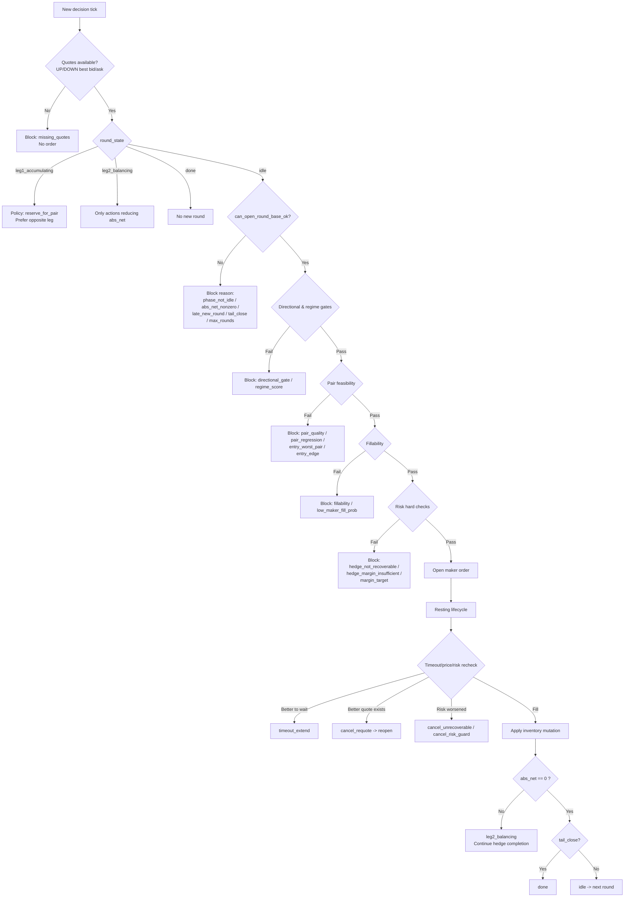
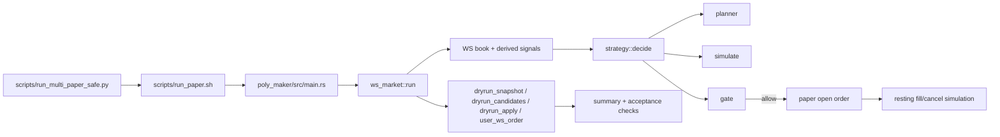
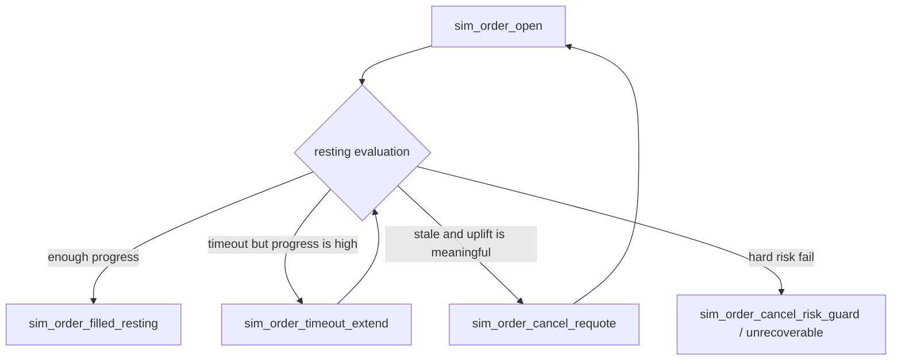

# Poly-Maker-RS

Language: [English](README.md) | [中文](README_zh.md)

This repository contains a Rust-based **maker-only** Polymarket CLOB arbitrage bot with a full paper-trading simulation and acceptance workflow.

This README is the **English deep-dive baseline** for the current stable strategy version, using only one window:

- Baseline window: `logs/multi/btc/1771704000/btc_1771704000_paper.jsonl`
- Baseline story plot: `logs/multi/btc/1771704000/btc_1771704000_paper_story.png`

No conclusions in this document depend on older windows.

---

## [S00B] Core Philosophy: No-Risk First, Then Budget Utilization

This project is intentionally built around a constrained optimization problem:

$$
\max \mathbb{E}[\mathrm{window\_pnl}]
$$

Plain text: `maximize E[window_pnl]`.

subject to hard safety constraints:

$$
\mathrm{maker\_only},\ \mathrm{executed\_pair\_cost} \le 0.995,\ \mathrm{final\_abs\_net}=0,\ \mathrm{unmatched\_loss}=0
$$

Plain text: `maker-only, executed_pair_cost <= 0.995, final_abs_net = 0, unmatched_loss = 0`.

So the bot is not a generic "trade more" executor. It is a **strict no-risk pair-closure engine** that spends budget only when all closure conditions are simultaneously feasible.

### The practical tradeoff we optimize

At runtime we balance two goals:

1. **Risk closure first**: never open risk that cannot be closed within current market conditions.
2. **Utilization second**: under (1), increase trading density and spend ratio as much as possible.

This is why the system can look conservative in some local periods while still producing strong rolling PnL.

### How this is encoded in code (high level)

1. **Open-round feasibility** (`planner`):
   - `can_start_new_round` requires base state, pair quality, edge, fillability, regime score, and budget readiness.
   - Key path: `poly_maker/src/strategy/planner.rs` (`build_round_plan`, entry evaluation and block reasons).
2. **Hard execution risk gate** (`gate`):
   - rejects taker, unrecoverable hedge, insufficient hedge margin, pair-cap violations, tail violations.
   - Key path: `poly_maker/src/strategy/gate.rs`.
3. **Open-order runtime guard** (`ws_market`):
   - already-open resting orders are rechecked and canceled if they become unsafe (`sim_order_cancel_unrecoverable`, `sim_order_cancel_risk_guard`).
   - Key path: `poly_maker/src/ws_market.rs`.
4. **Maker quote and fillability modeling** (`simulate` + `ws_market`):
   - dynamic cap, passive-gap penalties, queue/consumption-based fill probability.
   - Key paths: `poly_maker/src/strategy/simulate.rs`, `poly_maker/src/ws_market.rs`.

### What the latest rolling 10-window experiment shows

From `logs/multi/btc_roll10.csv` and `logs/multi/btc/budget_curve_1771696194.csv`:

1. **Safety invariants held across all 10 windows**
   - `final_abs_net = 0` for every window.
   - `unmatched_loss_usdc = 0` for every window.
   - `max_executed_sim_pair_cost <= 0.995` (worst observed: `0.994286`).
   - taker actions remained `0`.
2. **Performance**
   - total PnL: `+19.07 USDC`.
   - rolling budget: `100.00 -> 119.07`.
3. **Utilization**
   - median spent ratio: `0.3925`.
   - late windows reached high utilization (`~0.75-0.89`) while keeping no-risk constraints.

### Why local "missed opportunities" still happen

The largest deny/block reasons in rolling diagnostics are:

1. `reserve_for_pair`: budget is intentionally reserved for hedge completion.
2. `locked_strict_abs_net`: after lock conditions are met, policy prefers preserving no-risk state over reopening risk.
3. `fillability` / `directional_gate`: signals exist, but expected maker execution quality is below required floor.

These are **design choices**, not accidental failures.

### Remaining unvalidated risk before real-money deployment

Paper mode is robust but still a model. Gaps to live Polymarket:

1. **Queue priority realism**: real queue position and adverse selection can differ from simulation assumptions.
2. **Maker/taker boundary**: post-only behavior in real exchange micro-timing needs live validation.
3. **Execution race conditions**: cancel/replace and websocket latency races are harsher in production.
4. **Economic completeness**: fees/rebates/gas/funding timing are simplified in current paper PnL.
5. **Capital timing**: settlement and usable-balance timing for rolling compounding need live-account validation.

Use this as the guiding principle for all future changes:

> Any improvement must increase utilization or PnL **without weakening** the hard no-risk closure guarantees.

### One-Page Decision Tree (When to Open, Balance, or Stop)



Interpretation:

1. **Idle does not mean "free to trade"**; it only means phase state is open for evaluation.
2. A new opening leg exists only if all layers pass: base -> directional/regime -> pair feasibility -> fillability -> hard risk.
3. Once exposure exists (`abs_net > 0`), policy shifts to **closure priority** (`leg2_balancing`) until inventory is balanced.
4. In tail close, increasing-risk actions are denied; only net-reducing closure actions survive.

---

## [S00A] Reading Guide (One-Page Index)

If you are new to this repo, read in this order:

1. `S00` for notation and event vocabulary.
2. `S04` + `S05` + `S06` to understand decision, sizing, and start conditions.
3. `S07` + `S08` for pricing model and hard no-risk gates.
4. `S10` + `S11` for real examples from window `1771704000`.
5. `S12` for reproducible acceptance commands.
6. `S12A` for 10-window rolling-budget compounding results.
7. `S12B` for deep diagnostics on local failures in those 10 windows.

### Baseline scorecard (`1771704000`)

| Goal | Metric | Result |
| --- | --- | --- |
| Maker-only | taker actions | none |
| No-risk hard cap | max executed pair cost | `0.9794308943 <= 0.995` |
| Execution quality | fill rate | `50/61 = 0.8197` |
| Position closure | final abs net | `0` |
| Capital use | spent total | `97.82 / 112.02` |
| Pair arbitrage quality | final pair cost | `0.9590196078 < 1` |

### Quick jump by question

- “Why did it trade or not trade?” -> `S06`, `S09B`, `S10`.
- “How is order qty decided?” -> `S05`.
- “How is maker fill estimated?” -> `S07`, `S09`.
- “How does no-risk protection work?” -> `S08`, `S11`.
- “How do I rerun checks?” -> `S12`.
- “How did rolling 10-window compounding perform?” -> `S12A`.
- “Why did some checks fail while risk was still safe?” -> `S12B`.

---

## [S00] Notation and Core Terms

### Contract naming

- `UP` means YES token of the binary market.
- `DOWN` means NO token of the binary market.
- 1 share settles to 1 USDC if outcome is true for that token, else 0.

### Inventory and cost symbols

- `qty_up`, `qty_down`: shares currently held.
- `cost_up`, `cost_down`: cumulative paid USDC for each side.
- `avg_up`, `avg_down`: average entry cost per share.
- `pair_cost`: `avg_up + avg_down`.
- `abs_net`: `|qty_up - qty_down|`.

### Round terms

- `Leg1`: opening leg of a new round.
- `Leg2`: balancing leg to close net exposure of that round.
- `round_state`: `idle -> leg1_accumulating -> leg2_balancing -> done`.

### Event types in JSONL

- `dryrun_snapshot`: state + planner context at each decision tick.
- `dryrun_candidates`: all simulated candidates + deny reasons.
- `dryrun_apply`: executed inventory mutation.
- `user_ws_order`: synthetic order lifecycle events (`sim_order_open`, `sim_order_filled_resting`, cancels, extends, etc.).

---

## [S01] What This Bot Does

The bot performs **temporal YES/NO pair arbitrage** on one 15-minute market while enforcing strict no-risk constraints.

### Strategy objective

1. Buy maker quotes on one side when price/edge/flow gates allow.
2. Later buy maker quotes on the opposite side to complete the pair.
3. End with balanced inventory (`qty_up == qty_down`) and `pair_cost < 1`.

### Hard invariants (must hold)

1. Maker only for entry path (`ALLOW_TAKER=false`).
2. Hard pair cap on executed inventory (`NO_RISK_HARD_PAIR_CAP=0.995`).
3. Risk-increasing actions must satisfy recoverability and margin checks.
4. Tail logic prioritizes closure and balance near market end.

### Practical interpretation

If the bot cannot satisfy all hard gates, it should **not trade** rather than force execution.

---

## [S02] System Architecture (Code Map)

### Runtime entry and loop

- Entry: `poly_maker/src/main.rs`
- Runtime orchestrator (WS, decision loop, paper execution): `poly_maker/src/ws_market.rs`

### Strategy stack

- Planner and round plan: `poly_maker/src/strategy/planner.rs`
- Trade simulation and quote/fill model: `poly_maker/src/strategy/simulate.rs`
- Risk and execution gate: `poly_maker/src/strategy/gate.rs`
- Ledger and state machine: `poly_maker/src/strategy/state.rs`
- Candidate build + scoring: `poly_maker/src/strategy/mod.rs`

### Runner and acceptance scripts

- Safe runner and env injection: `scripts/run_multi_paper_safe.py`
- Single run wrapper: `scripts/run_paper.sh`
- Window summary/story exporter: `scripts/summary_run.py`
- Acceptance checks:
  - `scripts/check_run.sh`
  - `scripts/check_fill_estimator.sh`
  - `scripts/check_round_quality.sh`
  - `scripts/check_exec_quality.sh`

### Pipeline view



---

## [S03] Data Ingestion and Market Selection

### Fixed market mode

For this baseline:

- `MARKET_SLUG=btc-updown-15m-1771704000`

`scripts/validate_market_slug.py` validates:

1. slug format (`*-updown-15m-<ts>`)
2. market exists on Gamma
3. market is tradable (`acceptingOrders=true`, `enableOrderBook=true`)
4. both token IDs exist

### Real-time data maintained in runtime

At each loop, `ws_market.rs` updates and stores in ledger/snapshot:

1. best bid/ask and top size for UP and DOWN
2. consumption rate proxies (bid/ask side)
3. latency fields (`exchange_ts_ms`, local receipt timing)
4. regime/turn inputs used by planner (`pair_mid_vol_bps`, momentum/discount fields)

These values are the raw material for simulation, gating, and position sizing.

---

## [S03A] Derived Microstructure Factors (Exact Formulas)

This section explains the exact origin of the most-used planner factors.  
Short answer: these are **computed in our runtime**, not direct PM API fields.

### 3A.1 Raw market fields vs locally-derived factors

PM feed provides raw inputs such as:

- `best_bid_*`, `best_ask_*`
- top-level sizes
- `exchange_ts_ms`

Runtime derives and stores:

- `bid_consumption_rate_up`, `bid_consumption_rate_down`
- `mid_up_momentum_bps`, `mid_down_momentum_bps`
- `mid_up_discount_bps`, `mid_down_discount_bps`
- `pair_mid_vol_bps`

Main code path:

- quote update and rate update: `poly_maker/src/ws_market.rs:2890`
- consumption estimator: `poly_maker/src/ws_market.rs:3055`
- mid/discount/momentum/vol update: `poly_maker/src/ws_market.rs:3727`

### 3A.2 Mid price and momentum (bps)

`bps` means basis points: `1 bps = 0.01% = 0.0001`.

For each leg:

```text
mid = (best_bid + best_ask) / 2
momentum_bps_t = ((mid_t - mid_{t-1}) / mid_{t-1}) * 10000
```

Interpretation:

- positive momentum bps: current mid is rising
- negative momentum bps: current mid is falling

### 3A.3 Discount to slow EMA (bps)

Runtime maintains per-leg fast/slow EMA on mid price:

```text
ema_t = alpha * sample_t + (1 - alpha) * ema_{t-1}
alpha = 2 / (lookback_ticks + 1)
```

Discount field uses slow EMA:

```text
discount_bps = ((slow_ema - mid) / slow_ema) * 10000
```

Interpretation:

- positive discount bps: current mid is below slow baseline
- negative discount bps: current mid is above slow baseline

### 3A.4 Bid consumption rate (shares/sec proxy)

Estimator (`estimate_consumption_rate`) has two paths:

1. Same-price queue depletion:

```text
observed = (old_size - new_size) / dt_secs          # only if old_size > new_size
```

2. Price-move depletion (for bid, top bid moves down):

```text
observed = (queue_size * DEPTH_PRICE_MOVE_DEPLETION_RATIO) / dt_secs
DEPTH_PRICE_MOVE_DEPLETION_RATIO = 0.0025
```

Then EWMA smoothing + clamping:

```text
rate_t = alpha * observed + (1 - alpha) * rate_{t-1}   (alpha=0.35)
rate_t = clamp(rate_t, 0, 20)
```

Constants:

- `DEPTH_CONSUMPTION_EWMA_ALPHA = 0.35`
- `DEPTH_MIN_DT_SECS = 0.05`
- `DEPTH_PRICE_MOVE_MAX_OBSERVED_PER_SEC = 20.0`

So `bid_consumption_rate_up = 20.0` means the estimator hit the configured upper cap in that moment.

### 3A.5 Pair volatility factor

Per tick:

```text
ret_up_bps = abs(mid_up_t - mid_up_{t-1}) / mid_up_{t-1} * 10000
ret_down_bps = abs(mid_down_t - mid_down_{t-1}) / mid_down_{t-1} * 10000
inst_vol_bps = 0.5 * (ret_up_bps + ret_down_bps)
pair_mid_vol_bps_t = alpha * inst_vol_bps + (1 - alpha) * pair_mid_vol_bps_{t-1}
alpha = 2 / (VOL_ENTRY_LOOKBACK_TICKS + 1)
```

This is the planner's volatility-regime input.

### 3A.6 Worked example from baseline window (`1771704000`)

At snapshot `ts_ms=1771704418947` (`t=413.208s`):

- `best_bid_up=0.16`, `best_ask_up=0.18` -> `mid_up=0.17`
- previous `mid_up=0.17`
- `best_bid_down=0.82`, `best_ask_down=0.84` -> `mid_down=0.83`
- previous `mid_down=0.83`

Momentum:

```text
mid_up_momentum_bps   = (0.17 - 0.17) / 0.17 * 10000 = 0.00
mid_down_momentum_bps = (0.83 - 0.83) / 0.83 * 10000 = 0.00
```

Observed discount/flow fields at this snapshot:

- `mid_up_discount_bps=53.54`
- `mid_down_discount_bps=-11.04`
- `bid_consumption_rate_up=16.6733`
- `bid_consumption_rate_down=3.8549`

This is exactly the pre-open context used by the `paper-48` round in `S11A`.

---

## [S04] Decision Loop (What Happens Each Tick)

At each decision tick (`DRYRUN_DECISION_EVERY_MS`), runtime performs:

1. Refresh ledger from latest book state.
2. Process existing resting orders (fill, extend, requote, risk cancel).
3. Update round state and lock state.
4. Emit `dryrun_snapshot`.
5. Compute strategy decision via `strategy::decide(...)`.
6. Emit `dryrun_candidates` with allow/deny information.
7. If one action is allowed and selected, place paper maker order and emit `sim_order_open`.
8. If an order fills, emit `sim_order_filled_resting` then `dryrun_apply`.

### Important design point

`strategy/mod.rs` only generates opening maker actions when `round_plan.can_start_new_round=true`.
If balancing is required, it generates only balancing leg candidates.

---

## [S05] How Share Size Is Determined

Share size is a constrained optimization chain, not one threshold.

### Step 1: round target from budget

Implemented in `compute_round_qty_target(...)` in `planner.rs`.

```text
leg1_budget = round_budget_usdc * round_leg1_fraction
q_budget_leg1 = floor(leg1_budget / price_leg1)
q_budget_pair = floor(round_budget_usdc / (price_leg1 + price_leg2))
q_target_raw = min(q_budget_leg1, q_budget_pair)
```

### Step 2: top-of-book depth cap

Implemented in `cap_round_qty_by_visible_depth(...)`.

```text
q_depth_cap = floor(top_size_leg1 * ENTRY_MAX_TOP_BOOK_SHARE)
q_after_depth = min(q_target_raw, q_depth_cap)
```

### Step 3: expected-flow cap

Implemented in `cap_round_qty_by_expected_flow(...)`.

```text
consume_rate = max(observed_bid_consumption_rate, maker_flow_floor_per_sec)
q_flow_cap = floor(consume_rate * MAKER_FILL_HORIZON_SECS * ENTRY_MAX_FLOW_UTILIZATION)
q_after_flow = min(q_after_depth, q_flow_cap)
```

### Step 4: dynamic slicing

Implemented in `compute_dynamic_slice_count(...)` and `compute_slice_qty(...)`.

```text
slice_count = clamp(derived_count, ROUND_MIN_SLICES, ROUND_MAX_SLICES)
base_slice = ceil(q_after_flow / slice_count)
slice_qty = min(q_remaining, max(ROUND_MIN_SLICE_QTY, base_slice))
```

### Why orders often look like 3-6 shares

This is usually the intersection of budget math, visible depth cap, flow cap, and slice limits.
It is rarely caused by a single gate.

---

## [S06] Trigger Mechanism: When Can a New Arbitrage Round Start?

There is no single trigger. Planner uses a conjunction of constraints.

### Core decision equation

```text
can_start_new_round =
    can_open_round_base_ok
    AND qty_slice_exists
    AND budget_remaining_round > 0
    AND budget_remaining_total > 0
    AND hard_feasible
    AND edge_ok
    AND fillability_ok
    AND regime_score > 0
```

### Components and meanings

1. `can_open_round_base_ok`
- `round_state == idle`
- `abs_net` near zero
- not in tail-close forbidden zone for new rounds
- round start gap and volatility preconditions satisfied

2. `hard_feasible`
- `entry_worst_pair_ok`
- `pair_quality_ok`
- `pair_regression_ok` (mode-dependent, baseline `cap_edge`)

3. `edge_ok`
- `entry_edge_bps >= ENTRY_EDGE_MIN_BPS`

4. `fillability_ok`
- timeout-flow estimate passes
- fill-prob floor passes
- passive-gap soft limit passes

### Block reason introspection

`round_plan_can_start_block_reason` in snapshot tells first failing reason (`fillability`, `phase_not_idle`, `directional_gate`, `late_new_round`, etc.).

### Directional/reversal/turn gating details

Directional gate is computed per leg in planner:

```text
reversal_ok_for_leg =
    (discount_bps >= REVERSAL_MIN_DISCOUNT_BPS)
    AND (momentum_bps >= REVERSAL_MIN_MOMENTUM_BPS)
```

Turn confirmation (if enabled):

```text
turn_ok_for_leg =
    (discount_bps >= ENTRY_TURN_MIN_REBOUND_BPS)
    AND (momentum_bps >= ENTRY_TURN_MIN_REBOUND_BPS / ENTRY_TURN_CONFIRM_TICKS)
```

Baselines from current code defaults (`params.rs`):

- `REVERSAL_MIN_DISCOUNT_BPS = 6.0`
- `REVERSAL_MIN_MOMENTUM_BPS = 2.0`
- `ENTRY_TURN_MIN_REBOUND_BPS = 8.0`
- `ENTRY_TURN_CONFIRM_TICKS = 4`

Example at `ts_ms=1771676123989`:

- DOWN leg: `discount=25.18`, `momentum=149.25` -> strongly passes reversal gate.
- UP leg: `discount=-13.02`, `momentum=-75.19` -> fails reversal gate.

This is why the planner's directional bias is not random; it is deterministic from these computed factors.

---

## [S07] Maker Quote and Fill-Probability Model

### 7.1 Maker quote construction (`compute_maker_buy_quote`)

```text
base_postonly_price = post-only buy price from (best_bid, best_ask)

target_margin = max(
    entry_target_margin_min_ticks * tick,
    opp_ask * entry_target_margin_min_bps / 10000
)

dynamic_cap_price = floor_to_tick(
    no_risk_hard_pair_cap
    - entry_dynamic_cap_headroom_bps/10000
    - opp_ask
    - target_margin
)

final_price = min(base_postonly_price, dynamic_cap_price)    # when cap exists
passive_gap_abs = max(base_postonly_price - final_price, 0)
passive_gap_ticks = passive_gap_abs / tick
```

If `final_price` becomes invalid (< min price or non-finite), the candidate is not executable.

### 7.1A Why the bot may quote below current best bid

A common confusion is: "if DOWN is in a bullish signal regime, why quote `0.32` when book is `0.33/0.35`?"

The answer is that quote price is not chosen by trend alone. It is constrained by **hard no-risk completion math**.

At baseline tick `ts_ms=1771676123990` (`dryrun_candidates`):

- book: `best_bid_down=0.33`, `best_ask_down=0.35`
- opposite ask: `best_ask_up=0.67`
- computed:
  - `entry_quote_base_postonly_price=0.34`
  - `entry_quote_dynamic_cap_price=0.32`
  - `entry_quote_final_price=0.32`

Using baseline params (`run_multi_paper_safe.py`):

- `NO_RISK_HARD_PAIR_CAP = 0.995`
- `ENTRY_DYNAMIC_CAP_HEADROOM_BPS = 5`  -> `0.0005`
- `ENTRY_TARGET_MARGIN_MIN_TICKS = 0.3` with `tick=0.01` -> `0.003`
- `ENTRY_TARGET_MARGIN_MIN_BPS = 5` -> `0.000335` on `opp_ask=0.67`
- therefore `target_margin = max(0.003, 0.000335) = 0.003`

So:

```text
cap_raw = 0.995 - 0.0005 - 0.67 - 0.003 = 0.3215
cap_floor_to_tick = 0.32
final_price = min(base_postonly=0.34, cap=0.32) = 0.32
```

The same candidate also reported:

- `required_opp_avg_price_cap = 0.675`
- `current_opp_best_ask = 0.67`
- `hedge_recoverable_now = true`
- `hedge_margin_ok = true`
- `open_margin_surplus ~= 0` (right on boundary)

Meaning the quote is near the minimum safe boundary.  
Raising entry to `0.33/0.34` would push this boundary below current opposite ask and fail hard no-risk checks.

Interpretation:

1. Signal says DOWN is the preferred opening leg.
2. No-risk cap says "you may open, but only at or below 0.32".
3. The bot waits as maker for reversion/liquidity to reach that price.

This is intentional: it prioritizes no-risk completion feasibility over immediacy.

### 7.2 Fill probability (`maker_fill_prob`)

Used in simulation and resting logic.

```text
raw_queue_ahead = queue_size * maker_queue_ahead_mult

effective_queue_ahead = raw_queue_ahead * (
    1 + passive_ticks * maker_fill_passive_queue_penalty_per_tick
)

expected_consumed = consume_rate * horizon_secs
flow_ratio = expected_consumed / (effective_queue_ahead + order_qty)
fill_prob_base = 1 - exp(-flow_ratio)

fill_prob = fill_prob_base * exp(-maker_fill_passive_decay_k * passive_ticks)
fill_prob = clamp(fill_prob, 0, 1)
```

Interpretation:

- deeper passive quotes increase queue burden
- low expected flow lowers fill probability
- aggressive quote improvement can reduce queue ahead to near zero

### 7.3 Maker-only discipline

The strategy never intentionally crosses spread for entry. It relies on post-only pricing and simulated resting fills, consistent with maker-fee/rebate intent.

---

## [S08] Risk Control and Position Control

Risk control is layered in `gate.rs`, with hard no-risk checks first.

### 8.1 Pair-cost and inventory fundamentals (`state.rs`)

```text
avg_up = cost_up / qty_up           (if qty_up > 0)
avg_down = cost_down / qty_down     (if qty_down > 0)
pair_cost = avg_up + avg_down

hedgeable = min(qty_up, qty_down)
unhedged_up = max(qty_up - qty_down, 0)
unhedged_down = max(qty_down - qty_up, 0)
abs_net = |qty_up - qty_down|
```

### 8.2 Recoverability and margin checks (`simulate.rs`)

For risk-increasing buy actions:

```text
required_hedge_qty = |new_qty_up - new_qty_down|
total_qty_after_hedge = max(new_qty_up, new_qty_down)

required_opp_avg_price_cap =
    (no_risk_hard_pair_cap * total_qty_after_hedge - total_cost_after_fill)
    / required_hedge_qty

hedge_recoverable_now = (opp_ask <= required_opp_avg_price_cap * (1 + eps_bps/10000))

hedge_margin_to_opp_ask = required_opp_avg_price_cap - opp_ask
hedge_margin_required = max(min_ticks*tick, opp_ask*min_bps/10000)
hedge_margin_ok = hedge_margin_to_opp_ask >= hedge_margin_required
open_margin_surplus = hedge_margin_to_opp_ask - hedge_margin_required
```

### 8.3 Gate ordering (simplified)

1. Taker disabled
2. quote validity (`NoQuote` / low fill fallback)
3. hedge recoverability
4. hedge margin
5. open margin floor (`OpenMarginTooThin`)
6. budget caps
7. reserve-for-pair consistency
8. pair cap / no-improve / tail / lock restrictions
9. low maker fill probability (context-sensitive)

### 8.4 Lock policy

Lock behavior prevents reopening risky net exposure once safe progress is sufficient.
The key deny reason is `locked_strict_abs_net`.

### 8.5 No-risk design as a layered protection chain

No-risk is not one gate. It is a chain of defenses across planning, simulation, gating, and runtime order management.

```text
Layer 1 (Planner pre-check)
    projected_pair_cost / entry_worst_pair_cost / entry_edge_bps
    reject impossible or too-thin openings early

Layer 2 (Simulate math)
    dynamic_cap quote
    hedge_recoverable_now
    hedge_margin_ok
    open_margin_surplus

Layer 3 (Gate hard deny)
    enforce hard_pair_cap <= 0.995
    enforce recoverability + margin + open_margin floor
    enforce budget/reserve/tail/lock rules

Layer 4 (Runtime resting re-check)
    after order is open, re-simulate against latest book
    cancel on unrecoverable / pair-cap risk degradation
    extend timeout only with meaningful fill progress

Layer 5 (State/tail closure discipline)
    lock state prevents re-expanding risk after safe progress
    tail_close only allows abs_net reduction actions
```

In code terms:

- planner feasibility: `strategy/planner.rs` (`entry_worst_pair_ok`, `entry_edge_bps`, `can_start_new_round`)
- quote and recoverability math: `strategy/simulate.rs`
- hard deny ordering: `strategy/gate.rs`
- active-order risk guard and cancel/extend logic: `ws_market.rs`
- round/tail/lock transitions: `strategy/state.rs`

### 8.6 What "no-risk" means operationally

In this system, "no-risk" means:

1. every risk-increasing action must satisfy hard no-risk constraints **at decision time**;
2. open orders are continuously revalidated and cancelled if constraints break;
3. end-of-window behavior prioritizes closing net exposure.

It does **not** mean omniscient certainty under all future market paths.  
It means strict control under observable book + modeled worst-hedge assumptions, with fast corrective actions when conditions deteriorate.

---

## [S09] Paper Trading Emulation (No Official PM Paper API)

### 9.1 Resting order lifecycle



### 9.2 Adaptive horizon

`adaptive_order_horizon_secs(...)` computes a timeout horizon from queue, quantity, rate, and target fill probability:

```text
required_ratio = -ln(1 - timeout_target_fill_prob)
required_secs = ceil((queue_ahead + qty) * required_ratio / consume_rate)
horizon_secs = clamp(max(base_timeout_secs, required_secs), base_timeout_secs, max_age_secs)
```

### 9.3 Timeout extension condition

```text
fill_progress_ratio = consumed_qty / (queue_ahead + remaining_qty)

extend if:
    fill_progress_ratio >= paper_timeout_progress_extend_min
    AND timeout_extend_count < paper_timeout_max_extends
    AND paper_timeout_progress_extend_secs > 0
```

### 9.4 Requote condition (quality-aware)

Requote cancel is allowed only when stale/price/interval conditions are met and expected fill quality materially improves.
Key fields:

- `requote_prev_fill_prob`
- `requote_new_fill_prob`
- `requote_fill_prob_uplift`
- `requote_block_reason`

---

## [S09A] Baseline Parameter Snapshot (`1771704000`)

Injected by `scripts/run_multi_paper_safe.py`.

| Group | Parameter | Baseline Value |
| --- | --- | --- |
| Execution | `ALLOW_TAKER` | `false` |
| Hard risk | `NO_RISK_HARD_PAIR_CAP` | `0.995` |
| Pair mode | `NO_RISK_PAIR_LIMIT_MODE` | `hard_cap_only` |
| Entry regression | `ENTRY_PAIR_REGRESSION_MODE` | `cap_edge` |
| Rounds | `MAX_ROUNDS` | `6` |
| Edge floor | `ENTRY_EDGE_MIN_BPS` | `20` |
| Entry fill floor | `ENTRY_FILL_PROB_MIN` | `0.05` |
| Open fill floor | `OPEN_MIN_FILL_PROB` | `0.06` |
| Dynamic cap headroom | `ENTRY_DYNAMIC_CAP_HEADROOM_BPS` | `5` |
| Margin target ticks | `ENTRY_TARGET_MARGIN_MIN_TICKS` | `0.3` |
| Margin target bps | `ENTRY_TARGET_MARGIN_MIN_BPS` | `5` |
| Passive soft limit | `ENTRY_PASSIVE_GAP_SOFT_MAX_TICKS` | `3.0` |
| Queue penalty | `MAKER_FILL_PASSIVE_QUEUE_PENALTY_PER_TICK` | `1.25` |
| Passive decay | `MAKER_FILL_PASSIVE_DECAY_K` | `0.35` |
| Fill horizon | `MAKER_FILL_HORIZON_SECS` | `12` |
| Depth cap | `ENTRY_MAX_TOP_BOOK_SHARE` | `0.35` |
| Flow cap | `ENTRY_MAX_FLOW_UTILIZATION` | `0.75` |
| Timeout | `PAPER_ORDER_TIMEOUT_SECS` | `18` |
| Timeout extend threshold | `PAPER_TIMEOUT_PROGRESS_EXTEND_MIN` | `0.50` |
| Timeout extend seconds | `PAPER_TIMEOUT_PROGRESS_EXTEND_SECS` | `12` |
| Requote uplift min | `REQUOTE_MIN_FILL_PROB_UPLIFT` | `0.015` |
| Lock rounds | `LOCK_MIN_COMPLETED_ROUNDS` | `5` |
| Lock spent ratio | `LOCK_MIN_SPENT_RATIO` | `0.55` |
| Open margin surplus floor | `OPEN_MARGIN_SURPLUS_MIN` | `0.0005` |

---

## [S09B] Field Dictionary (Important Terms and Real Meanings)

### Snapshot (`dryrun_snapshot`) fields

| Field | Real meaning in code |
| --- | --- |
| `can_start_new_round` | final planner boolean for opening leg eligibility at this tick |
| `round_plan_can_start_block_reason` | first failing condition in planner decision tree |
| `round_plan_pair_quality_ok` | projected pair cost under entry pair limit |
| `round_plan_pair_regression_ok` | regression mode check (`strict/soft/cap_edge`) |
| `round_plan_entry_timeout_flow_ok` | timeout flow ratio meets minimum |
| `round_plan_entry_fillability_ok` | combined fillability gate (flow + fill prob + passive gap) |
| `round_plan_entry_edge_bps` | edge distance vs limit (bps) |
| `round_plan_entry_regime_score` | directional/regime score used in candidate ranking |
| `round_plan_slice_count_planned` | planner-selected number of slices |
| `round_plan_slice_qty_current` | qty requested this decision tick |
| `pair_cost` | current average pair cost from inventory (`avg_up + avg_down`) |
| `qty_up`, `qty_down` | current holdings |
| `spent_total_usdc` | cumulative capital used in this window |
| `round_state` | state machine phase |
| `locked` | lock policy active flag |
| `max_executed_sim_pair_cost_window` | worst executed pair cost so far in this window |
| `timeout_extend_count_window` | count of timeout extensions in this window |
| `cancel_unrecoverable_count_window` | count of unrecoverable cancels in this window |

### Candidate (`dryrun_candidates.candidates[]`) fields

| Field | Real meaning |
| --- | --- |
| `action` | action id (`BUY_UP_MAKER`, `BUY_DOWN_MAKER`, etc.) |
| `qty` | proposed order size after planning/slicing |
| `fill_price` | simulated maker fill price for this candidate |
| `maker_fill_prob` | simulated fill probability from queue/flow/passive model |
| `maker_queue_ahead` | effective queue ahead after passive penalty |
| `maker_expected_consumed` | expected consumed size in horizon |
| `sim_pair_cost` | projected pair cost if this candidate executes |
| `hedge_recoverable_now` | if opposite leg can still be completed under hard cap |
| `hedge_margin_ok` | if margin-to-hedge requirement is satisfied |
| `open_margin_surplus` | `hedge_margin_to_opp_ask - hedge_margin_required` |
| `deny_reason` | gate decision cause when rejected |

### Order/event (`user_ws_order`) fields

| Field | Real meaning |
| --- | --- |
| `raw_type=sim_order_open` | paper maker order accepted/opened |
| `raw_type=sim_order_filled_resting` | resting order got filled by simulated book consumption |
| `raw_type=sim_order_timeout_extend` | timeout horizon extended due to high fill progress |
| `raw_type=sim_order_cancel_requote` | order canceled to requote due to meaningful quality uplift |
| `raw_type=sim_order_cancel_unrecoverable` | canceled because risk checks fail for continuing this resting order |
| `fill_progress_ratio` | consumed progression vs required queue+qty |
| `old_horizon_secs/new_horizon_secs` | timeout horizon before/after extension |
| `requote_prev_fill_prob/new_fill_prob` | estimated fill quality before/after repricing |
| `requote_fill_prob_uplift` | delta used to validate requote usefulness |

### Deny reason examples in this baseline

| Deny reason | Meaning in this code path |
| --- | --- |
| `reserve_for_pair` | keep budget/phase for pair completion; block wrong-side expansion |
| `locked_strict_abs_net` | lock state blocks new absolute-net increase |

### Field-to-code locator (source of truth)

| Concept / field | Primary code location |
| --- | --- |
| `pair_cost`, `hedgeable`, `abs_net` | `poly_maker/src/strategy/state.rs` (`Ledger` methods) |
| `round_plan_*` start/block logic | `poly_maker/src/strategy/planner.rs` (`plan_round`) |
| `round qty target` / depth cap / flow cap / slicing | `poly_maker/src/strategy/planner.rs` (`compute_round_qty_target`, `cap_*`, `compute_slice_qty`) |
| maker quote (`entry_quote_*`, `passive_gap_*`) | `poly_maker/src/strategy/simulate.rs` (`compute_maker_buy_quote`) |
| `maker_fill_prob`, `maker_queue_ahead`, `maker_expected_consumed` | `poly_maker/src/strategy/simulate.rs` (`simulate_trade`) |
| `hedge_recoverable_now`, `required_opp_avg_price_cap` | `poly_maker/src/strategy/simulate.rs` (`evaluate_hedge_recoverability`) |
| `open_margin_surplus` and margin checks | `poly_maker/src/strategy/simulate.rs` + `poly_maker/src/strategy/gate.rs` |
| deny reasons (`reserve_for_pair`, `locked_strict_abs_net`, etc.) | `poly_maker/src/strategy/gate.rs` (`evaluate_action_gate_with_context`) |
| `sim_order_timeout_extend` and extend counters | `poly_maker/src/ws_market.rs` (`process_paper_resting_fills`) |
| `sim_order_cancel_requote` and uplift fields | `poly_maker/src/ws_market.rs` (`process_paper_resting_fills`) |
| acceptance metrics (`wait_per_selected`, `allow_fill_prob_p50`, `spent_utilization`) | `scripts/check_exec_quality.sh` (embedded Python) |
| round quality metrics (`apply_interval_p50`, spent checks) | `scripts/check_round_quality.sh` (embedded Python) |

---

## [S10] Deep Dive: Window `1771704000`

### Canonical artifacts

- `logs/multi/btc/1771704000/btc_1771704000_paper_story.md`
- `logs/multi/btc/1771704000/btc_1771704000_paper_story_events.csv`
- `logs/multi/btc/1771704000/btc_1771704000_paper_timeseries.csv`
- `logs/multi/btc/1771704000/btc_1771704000_paper_denies.csv`
- `logs/multi/btc/1771704000/btc_1771704000_paper_story.png`


### Final outcome metrics (ground truth)

| Metric | Value |
| --- | ---: |
| `best_action_ticks` | 1539 |
| `candidate_applied_ticks` | 1539 |
| `dryrun_apply` | 50 |
| `sim_order_open` | 61 |
| `sim_order_filled_resting` | 50 |
| Fill rate (`fill/open`) | 0.8197 |
| `spent_total_usdc` | 97.82 |
| `pair_cost_final` | 0.9590196078 |
| `qty_up` | 102 |
| `qty_down` | 102 |
| `final_abs_net` | 0 |
| `max_executed_sim_pair_cost_window` | 0.9794308943 (`<= 0.995`) |

### Time milestones (relative to window start)

| Time (s) | Event |
| ---: | --- |
| 2.599 | first `can_start_new_round=true` |
| 2.601 | first `sim_order_open` (`buy`, price `0.52`, size `10`) |
| 42.499 | first `sim_order_filled_resting`; first actual apply |
| 365.707 | first observed `locked=true` snapshot |
| 462.508 | spent crossed 90 USDC |
| 482.204 | last resting fill |
| 482.205 | first `locked_strict_abs_net` deny |

### First-half vs second-half activity

Computed by splitting snapshot timeline midpoint:

- `spent_by_half`: first `78.97`, second `97.82`
- `open/fill by half`:
  - first half: open `50`, fill `37`
  - second half: open `11`, fill `13`

Interpretation:

- strategy was most aggressive earlier when more rounds and time remained
- later stage shifted to closure/lock-aware behavior, with smaller incremental spend

### Planner/gate context in this window

- `can_start_new_round_true_ratio = 0.6934` (2644 / 3813 snapshots)
- top block reasons in snapshots:
  - `phase_not_idle: 773`
  - `directional_gate: 172`
  - `balance_required: 142`
  - `leg2_balancing: 59`
  - `late_new_round: 22`

This is expected: the strategy spends much time in active phases, and only opens new rounds when all conjunction gates align.

---

## [S11] Local Block/Repair Cases Inside `1771704000`

These are **controlled local events**, not a strategy breakdown.

### 11.1 `margin_target` blocks (count = 347)

Example around `t=82.701s`:

- candidate: `BUY_DOWN_MAKER`, qty `8`
- observed quality fields:
  - `maker_fill_prob=0.15207`
  - `sim_pair_cost=0.99567`
  - `hedge_recoverable_now=true`
  - `hedge_margin_ok=true`
  - `open_margin_surplus=0.07750`
- denied as `margin_target`

Meaning: even with acceptable fillability, projected pair quality was too close to (or beyond) target guardrails.

### 11.2 `locked_strict_abs_net` blocks (count = 959)

Example around `t=482.205s`:

- candidate: `BUY_DOWN_MAKER`, qty `4`
- quality still looks acceptable:
  - `maker_fill_prob=0.16178`
  - `sim_pair_cost=0.95632`
- denied as `locked_strict_abs_net`

Meaning: once lock policy is active, net-risk expansion is blocked by design.

### 11.3 Timeout extension protects near-filled orders (count = 2)

Example around `t=218.803s`:

- `fill_progress_ratio=0.88968`
- `old_horizon_secs=20 -> new_horizon_secs=32`
- `passive_ticks_at_extend=2`

Meaning: do not cancel an order that is already materially progressing.

### 11.4 Requote only when quality uplift is material (count = 7)

Example around `t=108.603s`:

- `requote_prev_fill_prob=0.000038`
- `requote_new_fill_prob=0.481178`
- uplift `+0.481140`
- `requote_block_reason=hard_stale_with_uplift`

Meaning: requote is a quality-driven correction, not random churn.

---

## [S11A] Forensic Replay: `1771704000` (`paper-48` -> `paper-53`)

This section is a full micro replay of one real round chain, from first-leg open to tail balancing slices.

### Scope and data sources

- Window: `logs/multi/btc/1771704000/btc_1771704000_paper.jsonl`
- Event timeline: `logs/multi/btc/1771704000/btc_1771704000_paper_story_events.csv`
- Planner/snapshot context: `logs/multi/btc/1771704000/btc_1771704000_paper_timeseries.csv`
- Plot: `logs/multi/btc/1771704000/btc_1771704000_paper_story.png`

Visual replay (single-window micro behavior):


### Replay timeline (key points)

| Time | Event | Book at decision (`UP bid/ask`, `DOWN bid/ask`) | Why it happened |
| ---: | --- | --- | --- |
| `413.250s` | `sim_order_open paper-48` `BUY_UP_MAKER` `7 @ 0.15` | `0.16/0.18`, `0.82/0.84` | New round start passed (`pair_quality_ok`, `pair_regression_ok`, `fillability_ok`, `edge_bps=294.60`) |
| `419.450s` | `sim_order_open paper-49` `BUY_DOWN_MAKER` `4 @ 0.80` | `0.16/0.19`, `0.81/0.84` | Opposite-leg resting quote for faster hedge closure once fills arrive |
| `444.450s` | `sim_order_cancel_requote paper-49` | `0.14/0.15`, `0.85/0.86` | Quote became stale; fill-prob uplift justified requote (`0.0238 -> 0.3244`) |
| `445.950s` | `sim_order_open paper-50` `BUY_DOWN_MAKER` `4 @ 0.83` | `0.14/0.16`, `0.84/0.86` | Repriced to better queue/fill profile while staying maker-safe |
| `455.250s` | `sim_order_timeout_extend paper-48` | `0.14/0.16`, `0.84/0.86` | High progress (`fill_progress_ratio=0.8113`) triggered extend (`42s -> 54s`) |
| `456.548s` | `sim_order_filled_resting paper-48` | `0.16/0.17`, `0.83/0.84` | First leg filled (`UP +7`) |
| `456.549s` | `sim_order_filled_resting paper-50` | `0.16/0.17`, `0.83/0.84` | Opposite leg filled (`DOWN +4`), enter `leg2_balancing` |
| `456.551s` / `457.351s` / `458.151s` | `sim_order_open paper-51/52/53` each `DOWN +1` | `0.83~0.84` area | Residual net `+3 UP` closed via micro slices in balancing phase only |

Inventory path in this chain:

- Before `paper-48`: `qty_up=82`, `qty_down=82`
- After `paper-48 + paper-50` fills: `qty_up=89`, `qty_down=86`
- After `paper-51/52/53` fills: `qty_up=89`, `qty_down=89` (flat again)

### Formula restoration with actual numbers

#### A) `bid_consumption_rate_up = 16.6733` (local derived field)

Code path: `poly_maker/src/ws_market.rs` (`estimate_consumption_rate`).

```text
observed_rate = depletion_per_dt
rate_new = 0.35 * observed_rate + 0.65 * rate_prev
rate_clamped in [0, 20]
```

This is EWMA over live book depletion events, not a direct API field.

#### B) `mid_*_discount_bps` sign and leg preference

Code path: `poly_maker/src/ws_market.rs` (mid/EMA update).

```text
mid = (best_bid + best_ask) / 2
discount_bps = ((slow_ema - mid) / slow_ema) * 10000
```

At `413.250s`:

- `mid_up_discount_bps = +295.83` (UP is below slow baseline)
- `mid_down_discount_bps = -62.83` (DOWN is above slow baseline)

Planner gates use sign and threshold (`>=`), not absolute value.

#### C) `slice_qty=7` for `paper-48`

Code path: `poly_maker/src/strategy/planner.rs`.

1. Round target from budget:

```text
leg1_budget = round_budget_usdc * round_leg1_fraction
qty_raw = floor(leg1_budget / leg1_price)
max_pair_qty = floor(round_budget_usdc / (leg1_price + leg2_price))
qty_target_raw = min(qty_raw, max_pair_qty)
```

At `413.250s`:

- `round_budget_usdc=18.67`, `round_leg1_fraction=0.45`
- `leg1_price=0.16`, `leg2_price=0.82`
- `qty_raw=floor(8.4015/0.16)=52`
- `max_pair_qty=floor(18.67/0.98)=19`
- `qty_target_raw=19`

2. Depth and flow caps:

```text
depth_cap = floor(best_bid_size_up * ENTRY_MAX_TOP_BOOK_SHARE)
flow_cap = floor(bid_consumption_rate_up * MAKER_FILL_HORIZON_SECS * ENTRY_MAX_FLOW_UTILIZATION)
qty_target = min(qty_target_raw, depth_cap, flow_cap)
```

- `depth_cap=floor(334.31*0.35)=117`
- `flow_cap=floor(16.6733*12*0.75)=150`
- `qty_target=19`

3. Dynamic slicing:

```text
slice_count=3   (from ROUND_MIN_SLICES/ROUND_MAX_SLICES and per-slice cap)
slice_qty=ceil(19/3)=7
```

#### D) `entry_quote_base=0.17`, `dynamic_cap=0.15`, `final=0.15`

Code path: `poly_maker/src/strategy/simulate.rs` (`compute_maker_buy_quote`).

```text
base_postonly = min(best_bid + tick, best_ask - tick)
target_margin = max(min_ticks * tick, opp_ask * min_bps / 10000)
dynamic_cap = hard_pair_cap - headroom - opp_ask - target_margin
final_quote = min(base_postonly, dynamic_cap)
```

At `paper-48` open:

- `best_bid_up=0.16`, `best_ask_up=0.18`, `tick=0.01` -> `base=0.17`
- `opp_ask=best_ask_down=0.84`
- `target_margin=max(0.3*0.01, 0.84*5/10000)=0.003`
- `hard_pair_cap=0.995`, `headroom=5bps=0.0005`
- `dynamic_cap=0.995-0.0005-0.84-0.003=0.1515` -> floor tick `0.15`
- `final=min(0.17,0.15)=0.15`

#### E) `entry_edge_bps=294.60`

Code path: `poly_maker/src/strategy/planner.rs`.

```text
entry_worst_limit = effective_pair_limit - no_risk_entry_pair_headroom
entry_edge_bps = ((entry_worst_limit - entry_worst_pair_cost) / entry_worst_limit) * 10000
```

At `413.250s`:

- `entry_worst_limit = 0.995 - 0.0005 = 0.9945`
- `entry_worst_pair_cost = 0.9652015730`
- `entry_edge_bps = 294.6046`

#### F) `maker_fill_prob` (`mfp`) at `paper-48` open

Code path: `poly_maker/src/strategy/simulate.rs`.

```text
raw_queue = top_size * maker_queue_ahead_mult
effective_queue = raw_queue * (1 + passive_ticks * queue_penalty_per_tick)
expected_consumed = consume_rate * horizon_secs
flow_ratio = expected_consumed / (effective_queue + qty)
mfp = (1 - exp(-flow_ratio)) * exp(-decay_k * passive_ticks)
```

Numbers:

- `top_size=334.31`, `qty=7`, `consume_rate=16.6733`, `horizon=12`
- `passive_ticks=1` (price `0.15` vs bid `0.16`)
- `effective_queue=752.1975`
- `expected_consumed=200.0795`
- `mfp=0.1632577`

#### G) `fill_progress_ratio`, `old_horizon_secs`, timeout extension

Code path: `poly_maker/src/ws_market.rs`.

```text
required_consumption = queue_ahead + remaining_qty
fill_progress_ratio = consumed_qty / required_consumption
```

For `paper-48` at timeout check:

- `queue_ahead=752.1975`, `remaining_qty=7` -> `required=759.1975`
- `consumed_qty=615.9618` -> `progress=0.8113`

Base adaptive horizon:

```text
required_ratio = -ln(1 - timeout_target_fill_prob)
required_secs = ceil((queue_ahead + qty) * required_ratio / consume_rate)
old_horizon_secs = max(base_timeout_secs, required_secs)
```

- `timeout_target_fill_prob=0.60`
- `required_ratio=0.91629`
- `required_secs=42` -> `old_horizon_secs=42`

Since progress exceeded threshold (`>=0.50`) and extend budget remained:

- `old_horizon_secs=42 -> new_horizon_secs=54`

### Why `paper-51/52/53` are 1-share slices

After `paper-48` and `paper-50` filled, round state became `leg2_balancing` with residual net `+3 UP`.

- `round_plan_can_start_block_reason=leg2_balancing`
- planner no longer evaluates new-round edge/fillability path
- it executes pure hedge-improving balancing actions (`improves_hedge=true`)
- resulting sequence: `DOWN +1`, `DOWN +1`, `DOWN +1`

This is exactly the intended no-risk behavior: close residual net first, then reopen entry logic only after flat state is restored.

---

## [S12] Acceptance Workflow (Direct Re-run)

### 1) Script syntax check

```bash
bash -n scripts/check_run.sh scripts/check_fill_estimator.sh scripts/check_round_quality.sh scripts/check_exec_quality.sh
```

### 2) Resolve latest window

```bash
NEW_DIR="$(ls -td logs/multi/btc/[0-9]* | head -1)"
NEW_JSONL="$(ls "$NEW_DIR"/*_paper.jsonl | head -1)"
echo "NEW_DIR=$NEW_DIR"
echo "NEW_JSONL=$NEW_JSONL"
[[ -s "$NEW_JSONL" ]] || { echo "ERROR: empty jsonl"; exit 1; }
```

### 3) Summary and full checks

```bash
python scripts/summary_run.py "$NEW_JSONL" --story-plot
bash scripts/check_run.sh "$NEW_JSONL"
bash scripts/check_fill_estimator.sh "$NEW_JSONL"
MAX_ROUNDS=6 APPLY_INTERVAL_P50_EPS=0.005 bash scripts/check_round_quality.sh "$NEW_JSONL"
bash scripts/check_exec_quality.sh "$NEW_JSONL"
```

### 4) Quick sanity extraction (optional)

```bash
python - <<'PY' "$NEW_JSONL"
import json,sys,collections
p=sys.argv[1]
c=collections.Counter(); best=applied=dry=0; spent=pair=absn=None
for ln in open(p):
    o=json.loads(ln); d=o.get("data",{}) or {}
    if o.get("kind")=="dryrun_candidates":
        if d.get("best_action") is not None: best += 1
        if d.get("applied_action") is not None: applied += 1
        for x in d.get("candidates") or []:
            r=x.get("deny_reason")
            if r: c[r]+=1
    if o.get("kind")=="dryrun_apply": dry += 1
    if o.get("kind")=="user_ws_order":
        rt=d.get("raw_type")
        if rt: c[rt]+=1
    if o.get("kind")=="dryrun_snapshot":
        if isinstance(d.get("spent_total_usdc"),(int,float)): spent=float(d["spent_total_usdc"])
        if isinstance(d.get("pair_cost"),(int,float)): pair=float(d["pair_cost"])
        q1,q2=d.get("qty_up"),d.get("qty_down")
        if isinstance(q1,(int,float)) and isinstance(q2,(int,float)): absn=abs(float(q1)-float(q2))
open_n=c.get("sim_order_open",0); fill_n=c.get("sim_order_filled_resting",0)
print("best_action_ticks=",best,"candidate_applied_ticks=",applied,"dryrun_apply=",dry)
print("fill_rate=", round(fill_n/open_n,4) if open_n else None, "open=",open_n,"fill=",fill_n)
print("spent_total_usdc=",spent,"pair_cost_final=",pair,"final_abs_net=",absn)
print("top_counts=",c.most_common(12))
PY
```

---

## [S12A] Ten-Window Rolling-Budget Review (`btc`, compounding mode)

This section summarizes the continuous 10-window run you completed with:

- rolling budget mode: `--budget-roll-mode pnl_compound`
- budget floor: `--rolling-budget-floor 1`
- source artifacts:
  - `logs/multi/btc/budget_curve_1771696194.csv`
  - `logs/multi/btc_roll10.csv`
  - `logs/multi/btc_roll10_pnl_curve.png`

Visual dashboards for this 10-window batch:


### 12A.1 Compounding equation (implemented)

For window index `i`:

```text
start_budget_1 = 100
window_pnl_i = hedgeable_shares_i - spent_total_usdc_i
end_budget_i = max(rolling_budget_floor, start_budget_i + window_pnl_i)
start_budget_{i+1} = end_budget_i
```

This exactly matches runner implementation in `scripts/run_multi_paper_safe.py` and the PnL accounting in `scripts/summarize_multi.py`.

### 12A.2 Portfolio-level outcome (10 windows)

- Window range: `1771696800` -> `1771704900`
- Start budget: `100.00`
- End budget: `119.07`
- Total PnL: `+19.07`
- Win windows: `10/10` (win ratio `100%`)
- Worst window PnL: `+0.61`

Execution and risk profile over these 10 windows:

- `apply_total=368`, `sim_order_open_total=431`, apply/open ratio `0.8538`
- median apply count per window: `34.5` (min `11`, max `56`)
- median `final_pair_cost`: `0.973748` (min `0.901538`, max `0.983043`)
- `final_abs_net=0` in every window
- `unmatched_loss_usdc=0` in every window
- all windows respect hard cap: `max_executed_sim_pair_cost_window <= 0.995`

### 12A.3 Per-window compounding path

From `logs/multi/btc/budget_curve_1771696194.csv`:

| window_ts | start_budget | window_pnl | end_budget | spent_total | final_pair_cost | final_qty_up/down |
| --- | ---: | ---: | ---: | ---: | ---: | ---: |
| 1771696800 | 100.00 | +0.61 | 100.61 | 26.39 | 0.977407 | 27 / 27 |
| 1771697700 | 100.61 | +0.78 | 101.39 | 34.22 | 0.977714 | 35 / 35 |
| 1771698600 | 101.39 | +0.89 | 102.28 | 34.11 | 0.974571 | 35 / 35 |
| 1771699500 | 102.28 | +1.01 | 103.29 | 31.99 | 0.969394 | 33 / 33 |
| 1771700400 | 103.29 | +2.56 | 105.85 | 23.44 | 0.901538 | 26 / 26 |
| 1771701300 | 105.85 | +2.92 | 108.77 | 47.08 | 0.941600 | 50 / 50 |
| 1771702200 | 108.77 | +1.56 | 110.33 | 90.44 | 0.983043 | 92 / 92 |
| 1771703100 | 110.33 | +1.69 | 112.02 | 82.31 | 0.979881 | 84 / 84 |
| 1771704000 | 112.02 | +4.18 | 116.20 | 97.82 | 0.959020 | 102 / 102 |
| 1771704900 | 116.20 | +2.87 | 119.07 | 103.13 | 0.972925 | 106 / 106 |

### 12A.4 Detailed acceptance interpretation

What stayed consistently strong:

1. Hard risk gates remained green on all 10 windows.
2. Pair closure quality remained stable (`qty_up == qty_down` at end of each window).
3. Maker-only behavior was preserved (no taker path activated).
4. Compounding accounting is internally consistent:
   - runner settle logs
   - budget curve CSV
   - multi-window summary CSV
   all match the same PnL series.

What failed in some per-window checks (but does not indicate hard-risk regression):

1. `apply_interval_p50` failed in multiple windows because the check threshold used `0.8s` while strategy cadence in those windows was around `0.20~0.30s`.
2. `median_slice_qty <= 8` failed in a few windows (median slice around `17~23`) due to larger budget and aggressive participation when liquidity/flow gates allowed.
3. one window had `open_margin_surplus_p50` touching the configured floor.

These are **quality-threshold mismatches versus current execution tempo**, not no-risk failures.

### 12A.5 Recommended acceptance profile for this strategy tempo

If you keep the current strategy tempo unchanged, use a "rolling-fast" acceptance profile:

```bash
export APPLY_INTERVAL_P50_MIN=0.20
export APPLY_INTERVAL_P50_MIN_SMALL_SLICE=0.20
export APPLY_INTERVAL_P50_EPS=0.005
export MEDIAN_SLICE_QTY_MAX=24
export OPEN_MARGIN_SURPLUS_P50_MIN=0.0000
```

Then run the standard 10-window loop and `check_multi_pnl.sh` on `logs/multi/btc_roll10.csv`.

---

## [S12B] Ten-Window Local Failure Deep-Dive (Hard vs Soft)

This section compares your latest 10-window acceptance details with current code behavior and explains why some checks failed while hard no-risk objectives still held.

### 12B.1 Hard vs soft acceptance layers

| Layer | Objective | Where enforced | 10-window result |
| --- | --- | --- | --- |
| Hard risk | maker-only, `sim_pair_cost <= 0.995`, recoverable hedge, final balance | `gate.rs`, `simulate.rs`, `check_run.sh`, `check_round_quality.sh`, `check_exec_quality.sh` | Stable, all windows green |
| Soft execution quality | cadence, slice shape, margin-surplus distribution | `check_round_quality.sh`, `check_exec_quality.sh` | Some local fails (tempo/shape mismatch) |

Hard-risk headroom was still positive in all windows. Tightest window: `1771697700`, max executed pair cost `0.994286` (about `7.14 bps` below hard cap `0.995`).

### 12B.2 What failed and where

From the 10 windows (`1771696800` -> `1771704900`):

| Window | `apply_interval_p50` | `median_slice_qty <= 8` | `open_margin_surplus_p50 >= 0.001` |
| --- | --- | --- | --- |
| 1771696800 | pass (`4.999s`) | pass (`1`) | pass |
| 1771697700 | fail (`0.202s`) | fail (`17`) | pass |
| 1771698600 | fail (`0.299s`) | fail (`23`) | pass |
| 1771699500 | pass (`1.151s`) | fail (`22`) | pass |
| 1771700400 | fail (`0.300s`) | fail (`21`) | fail (`0.000`) |
| 1771701300 | fail (`0.299s`) | fail (`17`) | pass |
| 1771702200 | pass (`1.301s`) | pass (`4`) | pass |
| 1771703100 | pass (`1.100s`) | pass (`3`) | pass |
| 1771704000 | fail (`0.301s`) | pass (`5`) | pass |
| 1771704900 | fail (`0.298s`) | pass (`5`) | pass |

### 12B.3 Why these soft failures happen (code-level)

1. `apply_interval_p50` failures are threshold-regime effects, not risk breaks.
The check logic in `scripts/check_round_quality.sh` uses:
- default min interval `0.8s`
- but if `median_slice_qty <= 4`, min interval is relaxed to `0.3s`.
So windows with median slice `>4` and fast cadence around `0.30s` will fail the `0.8s` branch even if no-risk is intact.

2. `median_slice_qty` failures come from deliberate sizing aggressiveness under catch-up logic.
Sizing is built as:
- round target from budget (`compute_round_qty_target`)
- depth cap (`ENTRY_MAX_TOP_BOOK_SHARE`)
- flow cap (`ENTRY_MAX_FLOW_UTILIZATION`)
- dynamic slicing (`ROUND_MIN_SLICES`, `ROUND_MAX_SLICES`)
- spent/time-driven boost of effective entry limits and round budget.
Implementation path:
- `planner.rs`: `effective_entry_limits`, `effective_round_budget_usdc`, `compute_dynamic_slice_count`.
When spent pacing is behind and time is ample, this intentionally increases participation, so median slices can rise to `17~23`.

3. The single `open_margin_surplus_p50` failure (`1771700400`) is a boundary case.
`open_margin_surplus = hedge_margin_to_opp_ask - hedge_margin_required`.
Gate side still includes tolerance (`gate.rs`) and hard recoverability checks, so a local p50 at boundary did not produce hard-risk violation.

### 12B.4 Deny-structure regime shift across the 10 windows

Candidate deny reasons (aggregated from JSONL candidate rows):

- `reserve_for_pair`: dominant in earlier windows.
- `locked_strict_abs_net`: dominant in later windows.
- `margin_target`: appears as hard pair-quality guard in both phases.

Interpretation:

1. Early/mid phase:
`reserve_for_pair` is mostly planner/gate preserving pair completion budget and phase discipline while building rounds.

2. Later phase after stronger progress:
`locked_strict_abs_net` dominates once lock policy is active and the system suppresses new net-risk expansion.

3. In both phases:
`margin_target` remains hard pair-quality backstop (`pair` must remain within enforced limit stack).

### 12B.5 Concrete local failure snapshots (same 10-window batch)

1. `reserve_for_pair` example (`1771699500`)
- candidate: `BUY_DOWN_MAKER`, qty `19`
- `can_start_new_round=true`, edge/fillability were acceptable
- denied because gate phase/budget reservation logic blocked wrong-side expansion for pair completion.

2. `locked_strict_abs_net` example (`1771704900`)
- candidate: `BUY_DOWN_MAKER`, qty `5`, simulated pair still good
- denied because lock state forbids increasing absolute net exposure after lock is engaged.

3. `margin_target` example (`1771700400`)
- candidate simulated pair around `1.024` at that tick
- denied because it violated effective pair limit / hard pair control chain.

These are controlled safety behaviors, not strategy execution failures.

### 12B.6 Practical acceptance reading for current tempo

If you keep current strategy tempo and dynamic sizing:

1. Treat hard-risk checks as release gates.
2. Treat cadence/slice-shape checks as calibration diagnostics.
3. Use `S12A.5` rolling-fast profile when you want acceptance thresholds aligned to this tempo.

## [S13] Known Limitations and Next Step

1. Maker-only entry means missed opportunities when immediate crossing would be required.
2. PnL currently simplifies fee/rebate accounting.
3. Paper execution is model-based (queue/flow/probability), not exchange-native paper fills.
4. Rolling budget compounding is now available in runner mode (`--budget-roll-mode pnl_compound`), but rolling fee/rebate-corrected NAV accounting is still a next-phase task.

---

## [A1] Glossary Index Appendix

Use this appendix as a quick dictionary when reading logs, checks, and code.

| Term / Field | Practical meaning | Primary source location |
| --- | --- | --- |
| `abs_net` | absolute inventory imbalance: `|qty_up - qty_down|` | `poly_maker/src/strategy/state.rs` |
| `allow_fill_prob_p50` | median `maker_fill_prob` among allowed candidates in a window | `scripts/check_exec_quality.sh` |
| `avg_up`, `avg_down` | average inventory costs per side | `poly_maker/src/strategy/state.rs` |
| `balance_leg` | planner-selected leg used to flatten net exposure | `poly_maker/src/strategy/planner.rs` |
| `can_start_new_round` | planner decision: whether opening a new leg-1 is allowed now | `poly_maker/src/strategy/planner.rs` |
| `cap_edge` | regression mode where entry uses cap + edge threshold instead of strict monotonic pair regression | `poly_maker/src/strategy/params.rs`, `planner.rs` |
| `decision_seq` | monotonic decision counter for timeline ordering | `dryrun_snapshot`, `dryrun_candidates` |
| `dryrun_apply` | event emitted when inventory is actually mutated | JSONL `kind=dryrun_apply` |
| `dryrun_candidates` | per-tick candidate list with simulated metrics and deny reasons | JSONL `kind=dryrun_candidates` |
| `dryrun_snapshot` | per-tick state/planner snapshot exported for diagnosis | JSONL `kind=dryrun_snapshot` |
| `entry_edge_bps` | edge margin in basis points for entry quality gating | `planner.rs` |
| `entry_fillability_ok` | combined fillability gate (flow + fill prob + passive gap) | `planner.rs` |
| `fill_progress_ratio` | resting order progress ratio used for timeout extension | `ws_market.rs` |
| `fill_rate` | `sim_order_filled_resting / sim_order_open` | `scripts/check_exec_quality.sh` |
| `hedge_margin_ok` | margin-to-hedge check status after projected trade | `simulate.rs` / `gate.rs` |
| `hedge_recoverable_now` | whether opposite-leg completion remains feasible under hard cap | `simulate.rs` / `gate.rs` |
| `locked` | lock policy active state in snapshot | `dryrun_snapshot` |
| `locked_strict_abs_net` | deny reason: lock forbids new absolute-net increase | `gate.rs` |
| `maker_fill_prob` | modeled maker fill probability from queue/flow/passive penalties | `simulate.rs` |
| `maker_queue_ahead` | effective queue-ahead after passive adjustments | `simulate.rs` |
| `max_executed_sim_pair_cost_window` | worst executed pair cost observed in current window | `dryrun_snapshot` |
| `open_margin_surplus` | `hedge_margin_to_opp_ask - hedge_margin_required` | `simulate.rs`, `gate.rs` |
| `pair_cost` | average pair inventory cost: `avg_up + avg_down` | `state.rs` |
| `phase_not_idle` | common block reason when system is in active round phase | `round_plan_can_start_block_reason` |
| `reserve_for_pair` | deny reason: reserve budget/phase for pair completion | `gate.rs` |
| `round_state` | round machine phase (`idle`, `leg1_accumulating`, `leg2_balancing`, `done`) | `state.rs`, snapshot |
| `sim_order_cancel_requote` | event: cancel current order and requote with better expected quality | `ws_market.rs` |
| `sim_order_filled_resting` | event: resting maker order filled in paper simulation | `ws_market.rs` |
| `sim_order_open` | event: paper maker order created/opened | `ws_market.rs` |
| `sim_order_timeout_extend` | event: order horizon extended instead of timeout cancel | `ws_market.rs` |
| `spent_total_usdc` | cumulative capital consumed in the window | snapshot/check scripts |
| `timeout_extend_count_window` | cumulative timeout extensions in current window | snapshot/check scripts |
| `wait_per_selected(activity_ratio)` | waiting-open-order activity ratio used by exec-quality check | `scripts/check_exec_quality.sh` |

### Prefix-grouped JSONL field map

This view is optimized for log grep/debug by field-name prefix.

| Prefix | Typical `kind` | Example fields | What this group tells you |
| --- | --- | --- | --- |
| `round_plan_*` | `dryrun_snapshot`, `dryrun_candidates` | `round_plan_can_start_block_reason`, `round_plan_entry_edge_bps`, `round_plan_slice_qty_current` | Planner intent, start/stop reason, and planned sizing at this tick |
| `maker_*` | `dryrun_candidates` | `maker_fill_prob`, `maker_queue_ahead`, `maker_expected_consumed` | Fill-quality model output (queue, flow, expected fillability) |
| `entry_quote_*` | `dryrun_candidates`, `dryrun_apply` | `entry_quote_base_postonly_price`, `entry_quote_dynamic_cap_price`, `entry_quote_final_price` | How maker quote was formed (base post-only vs dynamic cap bound) |
| `hedge_*` | `dryrun_candidates`, `dryrun_apply`, `sim_order_open` | `hedge_recoverable_now`, `hedge_margin_ok`, `hedge_margin_to_opp_ask` | Whether adding this leg still allows safe pair completion |
| `required_*` | `dryrun_candidates` | `required_opp_avg_price_cap`, `required_hedge_qty` | Recoverability target and hedge requirement implied by projected state |
| `open_margin_*` | `dryrun_candidates`, `sim_order_open` | `open_margin_surplus` | Margin safety cushion beyond minimum requirement |
| `qty_*` / `cost_*` / `avg_*` | `dryrun_snapshot`, `dryrun_apply` | `qty_up`, `qty_down`, `cost_up`, `avg_down` | Inventory shape and average cost basis evolution |
| `spent_*` / `*_budget_*` | `dryrun_snapshot` | `spent_total_usdc`, `spent_round_usdc`, `total_budget_usdc` | Capital usage and remaining room |
| `round_*` | `dryrun_snapshot` | `round_state`, `round_idx`, `round_leg1_filled_qty` | State machine phase and round lifecycle progress |
| `locked*` / `lock_*` | `dryrun_snapshot`, `dryrun_candidates` | `locked`, `locked_hedgeable`, deny `locked_strict_abs_net` | Post-progress safety mode that suppresses new net-risk expansion |
| `*_count_window` | `dryrun_snapshot` | `fill_count_window`, `requote_count_window`, `timeout_extend_count_window` | Rolling execution/risk counters used by acceptance scripts |
| `best_*` | `dryrun_snapshot` | `best_bid_up`, `best_ask_down`, `best_bid_size_up` | Real-time top-of-book and top size inputs |
| `mid_*` / `pair_mid_*` | `dryrun_snapshot` | `mid_up_momentum_bps`, `pair_mid_vol_bps` | Regime/volatility features used by entry gating/scoring |
| `raw_type=sim_order_*` | `user_ws_order` | `sim_order_open`, `sim_order_filled_resting`, `sim_order_cancel_requote` | Simulated paper order lifecycle events |
| `deny_reason*` | `dryrun_candidates` | `deny_reason`, `deny_reason_top3` (decisions CSV) | Why a candidate was rejected at gate time |

### Formula quick reference

```text
pair_cost = avg_up + avg_down
abs_net = |qty_up - qty_down|
fill_rate = fills / opens
open_margin_surplus = hedge_margin_to_opp_ask - hedge_margin_required
```

---

## Minimal Run Guide

### Requirements

- Rust 1.75+
- `python3`
- `jq`
- optional: `matplotlib`

### Environment

```bash
conda env create -f environment.yml
conda activate poly-maker
```

### Single paper run

```bash
DRYRUN_MODE=paper \
ROLLOVER_LOG_JSON=1 \
ROLLOVER_LOG_VERBOSE=0 \
RUST_LOG=info \
./scripts/run_paper.sh
```

### Outputs

- `logs/<run_id>_paper_full.log`
- `logs/<run_id>_paper.jsonl`
- `logs/<run_id>_paper_summary.md`
- `logs/<run_id>_paper_story.md`
- `logs/<run_id>_paper_story.png`
