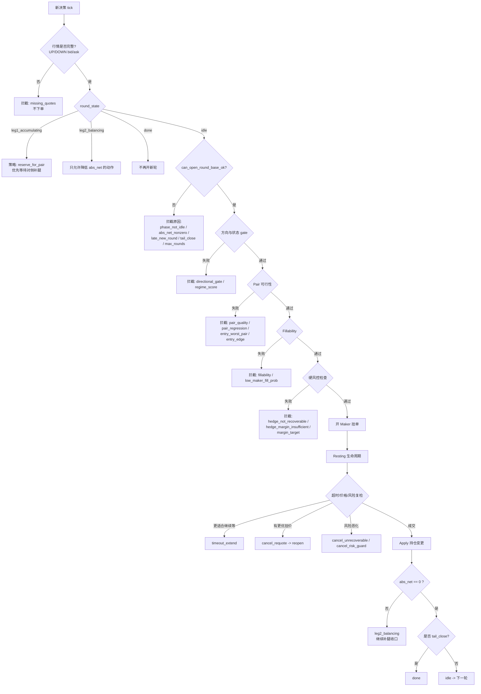
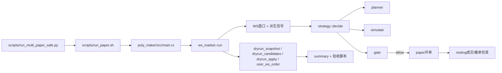
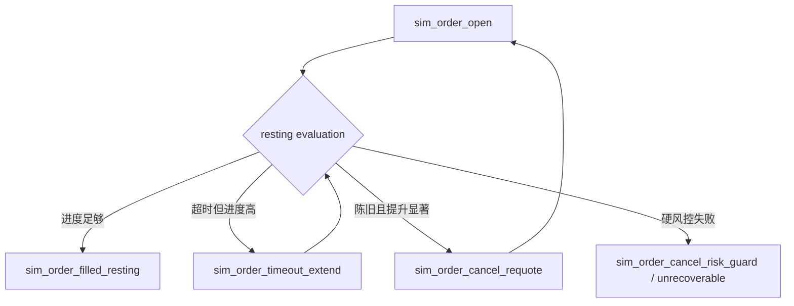
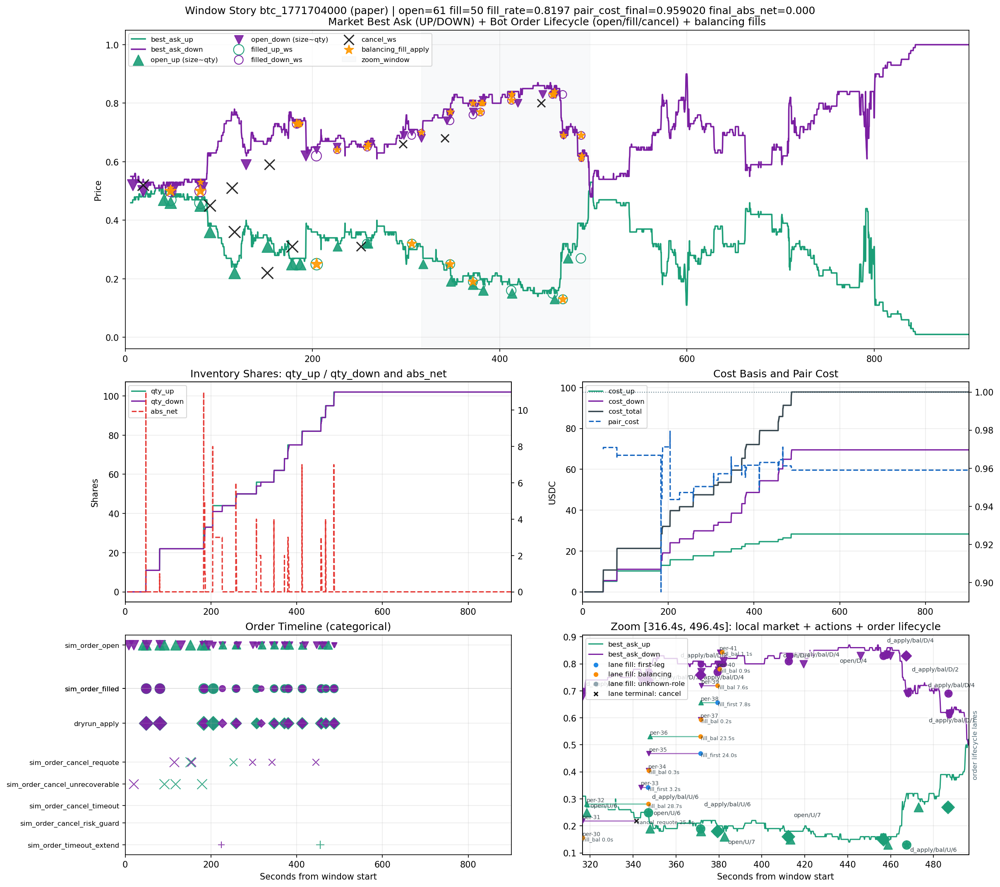
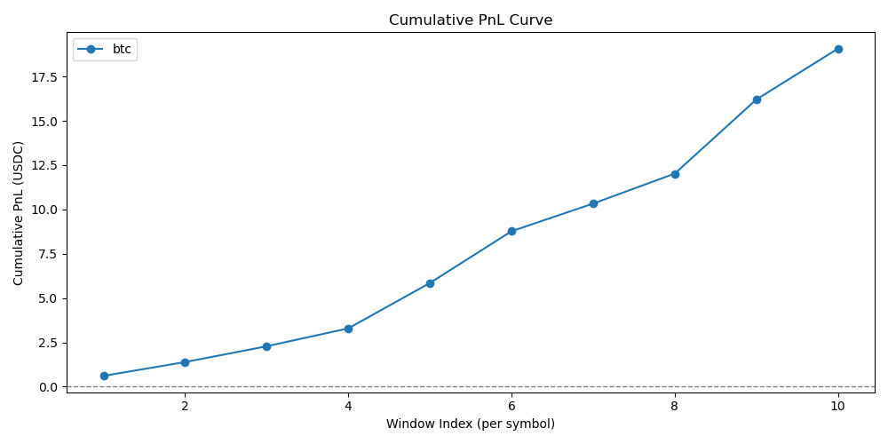
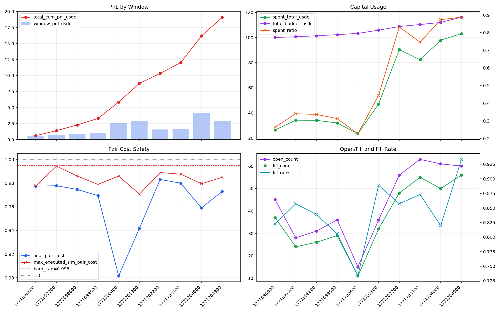
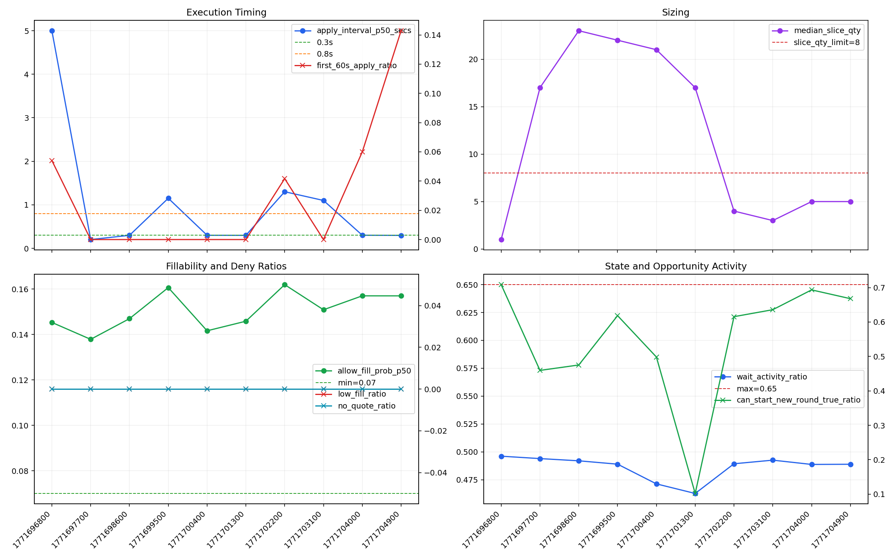
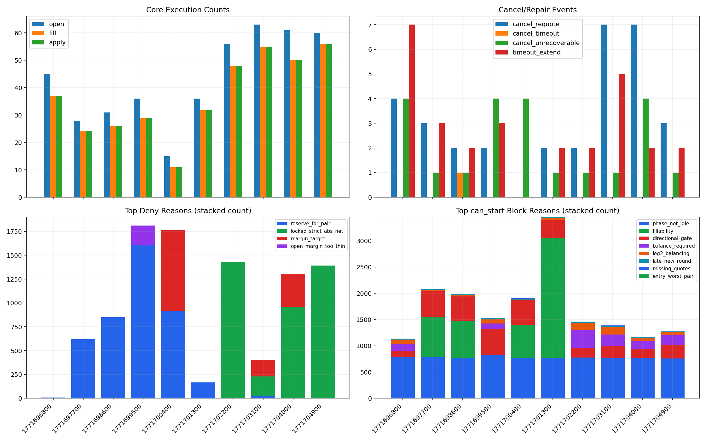

# Poly-Maker-RS（中文）

Language: [English](README.md) | [中文](README_zh.md)

本仓库是一个基于 Rust 的 **仅 Maker（maker-only）** Polymarket CLOB 套利机器人，包含完整的 paper trading 仿真与验收流程。

本文档是当前稳定策略版本的**中文深度说明**，并且只使用一个窗口作为基线：

- 基线窗口：`logs/multi/btc/1771704000/btc_1771704000_paper.jsonl`
- 基线故事图：`logs/multi/btc/1771704000/btc_1771704000_paper_story.png`

本文不使用旧窗口做结论（旧窗口代码版本不同）。

---

## [S00B] 核心思想：先保证 No-Risk，再追求资金利用率

本项目本质上是在做一个带硬约束的优化问题：

$$
\max \mathbb{E}[P_{\mathrm{window}}]
$$

纯文本：`maximize E[window_pnl]`。

但必须满足以下硬约束：

$$
\text{仅 Maker},\ \text{pair-cost} \le 0.995,\ \text{final abs net}=0,\ \text{unmatched loss}=0
$$

纯文本：`仅 Maker，executed_pair_cost <= 0.995，final_abs_net = 0，unmatched_loss = 0`。

所以机器人不是“尽量多交易”的通用执行器，而是一个**严格 no-risk 的配对收口引擎**：只有在“能开且能补且能收口”同时成立时才会用预算。

### 我们真正优化的 tradeoff

运行时目标按优先级分两层：

1. **先收风险**：绝不打开无法在当前条件下闭环的风险敞口。
2. **再提利用率**：在 1 成立的前提下，尽量提高交易密度和预算使用率。

这也是为什么局部看起来会“保守”，但连续窗口仍然可以积累稳定 PnL。

### 代码里如何落实（高层）

1. **开新轮可行性**（`planner`）：
   - `can_start_new_round` 必须同时满足基础状态、pair 质量、edge、fillability、regime score 和预算条件。
   - 关键实现：`poly_maker/src/strategy/planner.rs`（`build_round_plan` 及 block reason）。
2. **执行硬风控门**（`gate`）：
   - 拒绝 taker、不可恢复对冲、保证金不足、pair cap 超限、尾盘违规动作。
   - 关键实现：`poly_maker/src/strategy/gate.rs`。
3. **挂单后运行时风控**（`ws_market`）：
   - 已挂出的 resting order 会持续复算风险，若变危险就主动撤单（`sim_order_cancel_unrecoverable`、`sim_order_cancel_risk_guard`）。
   - 关键实现：`poly_maker/src/ws_market.rs`。
4. **Maker 报价与成交概率模型**（`simulate` + `ws_market`）：
   - dynamic cap、被动价差惩罚、queue/consumption 驱动的 fill probability。
   - 关键实现：`poly_maker/src/strategy/simulate.rs`、`poly_maker/src/ws_market.rs`。

### 最新连续 10 窗口实证说明了什么

基于 `logs/multi/btc_roll10.csv` 与 `logs/multi/btc/budget_curve_1771696194.csv`：

1. **10 窗口全部满足核心安全不变量**
   - 每窗 `final_abs_net = 0`。
   - 每窗 `unmatched_loss_usdc = 0`。
   - `max_executed_sim_pair_cost <= 0.995`（最差 `0.994286`）。
   - taker 行为持续为 `0`。
2. **收益表现**
   - 总 PnL：`+19.07 USDC`。
   - 滚动预算：`100.00 -> 119.07`。
3. **资金利用**
   - spent_ratio 中位数：`0.3925`。
   - 后段窗口可达到高利用率（约 `0.75-0.89`），且仍满足 no-risk 约束。

### 为什么局部会出现“有波动但没打满”

连续窗口的主 deny/block 原因是：

1. `reserve_for_pair`：策略主动留预算给补腿，不让首腿过度扩张。
2. `locked_strict_abs_net`：达到锁定条件后，优先保持 no-risk 状态而不是继续冒险。
3. `fillability` / `directional_gate`：有信号，但 maker 成交质量预估未达门槛。

这些是**主动设计**，不是偶发 bug。

### 上实盘前仍需验证的风险空白

Paper 已经很强，但仍是模型，和实盘还有距离：

1. **排队优先级真实性**：真实队列位置与逆向选择可能偏离模拟假设。
2. **maker/taker 边界**：post-only 在真实微秒级时序下是否稳定仍需实测。
3. **执行竞态**：撤单/改价与 WS 延迟竞态在生产环境更严苛。
4. **经济项完整性**：当前 paper PnL 简化了 fee/rebate/gas/资金时序。
5. **滚动资金可用性**：结算与可用余额时序在实盘账户需要单独验证。

后续所有优化都遵循同一条原则：

> 任何改动都必须在**不削弱硬 no-risk 收口保证**的前提下，提高利用率或 PnL。

### 一页决策树（何时开仓、补腿、停止）



解读：

1. `idle` 不等于“必然可交易”，只代表状态机允许进入评估层。
2. 只有 base -> directional/regime -> pair -> fillability -> hard risk 全部通过，才会真正开首腿。
3. 一旦出现净敞口（`abs_net > 0`），策略会切换到 `leg2_balancing`，优先补腿与收口。
4. 尾盘（`tail_close`）会收紧策略：禁止新增风险，只允许净风险下降动作。

---

## [S00A] 阅读导航（一页式索引）

如果你是第一次读这个仓库，建议按这个顺序：

1. 先看 `S00` 统一记号和事件词汇。
2. 再看 `S04` + `S05` + `S06` 理解决策、仓位和开轮条件。
3. 再看 `S07` + `S08` 理解定价模型和硬 no-risk 风控。
4. 再看 `S10` + `S11` 看 `1771704000` 的真实案例。
5. 先看 `S12` 直接复跑验收命令。
6. 再看 `S12A` 了解连续 10 窗滚动预算复盘结果。
7. 再看 `S12B` 深挖这 10 窗里的局部失败项与根因。

### 基线成绩单（`1771704000`）

| 目标 | 指标 | 结果 |
| --- | --- | --- |
| 仅 Maker | taker 行为 | 无 |
| 硬风控 pair cap | max executed pair cost | `0.9794308943 <= 0.995` |
| 执行质量 | fill rate | `50/61 = 0.8197` |
| 仓位收口 | final abs net | `0` |
| 资金使用 | spent total | `97.82 / 112.02` |
| 配对套利质量 | final pair cost | `0.9590196078 < 1` |

### 按问题快速跳转

- “为什么当下开/不开单？” -> `S06`、`S09B`、`S10`。
- “每次下单股数怎么来的？” -> `S05`。
- “maker 成交概率怎么估算？” -> `S07`、`S09`。
- “no-risk 保护如何起作用？” -> `S08`、`S11`。
- “怎么复跑验收？” -> `S12`。
- “10 窗滚动预算实测表现如何？” -> `S12A`。
- “为什么有些检查失败但风险仍然安全？” -> `S12B`。

---

## [S00] 记号与核心术语

### 合约命名

- `UP` 表示该二元市场的 YES token。
- `DOWN` 表示该二元市场的 NO token。
- 每 1 股在结算时要么兑付 1 USDC，要么兑付 0。

### 仓位与成本记号

- `qty_up`, `qty_down`：当前持仓股数。
- `cost_up`, `cost_down`：对应侧累计花费 USDC。
- `avg_up`, `avg_down`：每股平均持仓成本。
- `pair_cost`：`avg_up + avg_down`。
- `abs_net`：`|qty_up - qty_down|`。

### 轮次术语

- `Leg1`：一轮新开仓的第一腿。
- `Leg2`：用于配平该轮净敞口的第二腿。
- `round_state`：`idle -> leg1_accumulating -> leg2_balancing -> done`。

### JSONL 事件类型

- `dryrun_snapshot`：每个决策 tick 的状态与 planner 上下文。
- `dryrun_candidates`：候选动作及拒绝原因。
- `dryrun_apply`：真实库存变更事件。
- `user_ws_order`：合成订单生命周期事件（开单、成交、撤单、超时延长等）。

---

## [S01] 机器人在做什么

机器人在单个 15 分钟市场上执行 **YES/NO 时间序列配对套利**，并强制满足 no-risk 约束。

### 策略目标

1. 在机会出现时，先在一侧挂 maker 买单。
2. 后续在另一侧挂 maker 买单完成配对。
3. 最终达到 `qty_up == qty_down` 且 `pair_cost < 1`。

### 硬性不变量（必须满足）

1. 仅 Maker 入场（`ALLOW_TAKER=false`）。
2. 已执行仓位满足硬上限（`NO_RISK_HARD_PAIR_CAP=0.995`）。
3. 任何增加风险敞口的动作都必须通过 recoverability 和 margin 检查。
4. 尾盘阶段优先完成收口与配平。

### 实务含义

如果硬风控条件不满足，机器人应当选择不交易，而不是强行执行。

---

## [S02] 系统架构（代码地图）

### 运行入口与主循环

- 入口：`poly_maker/src/main.rs`
- 运行编排（WS、决策循环、paper 执行）：`poly_maker/src/ws_market.rs`

### 策略栈

- Planner 与 round plan：`poly_maker/src/strategy/planner.rs`
- 交易仿真与报价/成交模型：`poly_maker/src/strategy/simulate.rs`
- 风控与执行 gate：`poly_maker/src/strategy/gate.rs`
- 账本与状态机：`poly_maker/src/strategy/state.rs`
- 候选组装与评分：`poly_maker/src/strategy/mod.rs`

### 运行与验收脚本

- 安全 runner 与参数注入：`scripts/run_multi_paper_safe.py`
- 单窗运行封装：`scripts/run_paper.sh`
- 摘要/故事图输出：`scripts/summary_run.py`
- 验收：
  - `scripts/check_run.sh`
  - `scripts/check_fill_estimator.sh`
  - `scripts/check_round_quality.sh`
  - `scripts/check_exec_quality.sh`

### 流程图



---

## [S03] 数据采集与市场选择

### 固定市场模式

本基线窗口固定为：

- `MARKET_SLUG=btc-updown-15m-1771704000`

`scripts/validate_market_slug.py` 校验：

1. slug 格式正确（`*-updown-15m-<ts>`）
2. Gamma 上存在该市场
3. 市场可交易（`acceptingOrders=true`、`enableOrderBook=true`）
4. 两个 token ID 完整

### 运行时持续维护的数据

`ws_market.rs` 每轮会更新并写入 ledger/snapshot：

1. UP/DOWN 的 best bid/ask 与顶档 size
2. 买/卖侧消费速率估计
3. 延迟字段（`exchange_ts_ms` 与本地接收时间）
4. planner 使用的 regime/turning 输入（波动、动量、折价等）

这些数据是后续 simulate、gate、sizing 的基础输入。

---

## [S03A] 微观结构派生因子（精确公式）

本节解释 planner 高频使用因子的来源。  
结论先说：这些字段不是 PM API 直接给出的，而是我们在运行时本地计算并写入 snapshot。

### 3A.1 原始市场字段 vs 本地派生因子

PM feed 原始输入包括：

- `best_bid_*`, `best_ask_*`
- 顶档 size
- `exchange_ts_ms`

运行时本地派生并维护：

- `bid_consumption_rate_up`, `bid_consumption_rate_down`
- `mid_up_momentum_bps`, `mid_down_momentum_bps`
- `mid_up_discount_bps`, `mid_down_discount_bps`
- `pair_mid_vol_bps`

主代码路径：

- 盘口更新与 rate 更新：`poly_maker/src/ws_market.rs:2890`
- consumption 估计器：`poly_maker/src/ws_market.rs:3055`
- mid/discount/momentum/vol 更新：`poly_maker/src/ws_market.rs:3727`

### 3A.2 Mid 与动量（bps）

`bps` 是基点（basis points）：`1 bps = 0.01% = 0.0001`。

每条腿：

```text
mid = (best_bid + best_ask) / 2
momentum_bps_t = ((mid_t - mid_{t-1}) / mid_{t-1}) * 10000
```

解释：

- momentum 为正：mid 在上涨
- momentum 为负：mid 在下跌

### 3A.3 相对慢 EMA 的折价（bps）

运行时对每条腿的 mid 维护快/慢 EMA：

```text
ema_t = alpha * sample_t + (1 - alpha) * ema_{t-1}
alpha = 2 / (lookback_ticks + 1)
```

折价字段使用慢 EMA：

```text
discount_bps = ((slow_ema - mid) / slow_ema) * 10000
```

解释：

- discount 为正：当前 mid 低于慢均线（“折价”）
- discount 为负：当前 mid 高于慢均线

### 3A.4 买一消费速率（shares/sec 代理）

`estimate_consumption_rate` 有两种观测路径：

1. 同价位队列被吃（size 下降）：

```text
observed = (old_size - new_size) / dt_secs          # 仅当 old_size > new_size
```

2. 价格移动导致 depletion（对 bid 是 best bid 下跳）：

```text
observed = (queue_size * DEPTH_PRICE_MOVE_DEPLETION_RATIO) / dt_secs
DEPTH_PRICE_MOVE_DEPLETION_RATIO = 0.0025
```

再做 EWMA 平滑与截断：

```text
rate_t = alpha * observed + (1 - alpha) * rate_{t-1}   (alpha=0.35)
rate_t = clamp(rate_t, 0, 20)
```

常量：

- `DEPTH_CONSUMPTION_EWMA_ALPHA = 0.35`
- `DEPTH_MIN_DT_SECS = 0.05`
- `DEPTH_PRICE_MOVE_MAX_OBSERVED_PER_SEC = 20.0`

所以 `bid_consumption_rate_up = 20.0` 的含义是：该时刻估计值触发了上限截断。

### 3A.5 Pair 波动因子

每个 tick：

```text
ret_up_bps = abs(mid_up_t - mid_up_{t-1}) / mid_up_{t-1} * 10000
ret_down_bps = abs(mid_down_t - mid_down_{t-1}) / mid_down_{t-1} * 10000
inst_vol_bps = 0.5 * (ret_up_bps + ret_down_bps)
pair_mid_vol_bps_t = alpha * inst_vol_bps + (1 - alpha) * pair_mid_vol_bps_{t-1}
alpha = 2 / (VOL_ENTRY_LOOKBACK_TICKS + 1)
```

该值是 planner 的波动 regime 输入。

### 3A.6 基线窗实例代入（`1771704000`）

在 `ts_ms=1771704418947`（`t=413.208s`）：

- `best_bid_up=0.16`, `best_ask_up=0.18` -> `mid_up=0.17`
- 前一帧 `mid_up=0.17`
- `best_bid_down=0.82`, `best_ask_down=0.84` -> `mid_down=0.83`
- 前一帧 `mid_down=0.83`

动量：

```text
mid_up_momentum_bps   = (0.17 - 0.17) / 0.17 * 10000 = 0.00
mid_down_momentum_bps = (0.83 - 0.83) / 0.83 * 10000 = 0.00
```

该快照的折价/流速观测值：

- `mid_up_discount_bps=53.54`
- `mid_down_discount_bps=-11.04`
- `bid_consumption_rate_up=16.6733`
- `bid_consumption_rate_down=3.8549`

这正是 `S11A` 里 `paper-48` 开腿前的同一段上下文。

---

## [S04] 决策循环（每个 tick 做什么）

每个决策 tick（`DRYRUN_DECISION_EVERY_MS`）执行：

1. 用最新盘口刷新 ledger。
2. 处理现有 resting 单（成交、延时、重挂、风险撤单）。
3. 更新 round state 与 lock state。
4. 产出 `dryrun_snapshot`。
5. 调用 `strategy::decide(...)`。
6. 产出 `dryrun_candidates`。
7. 若有允许且被选中的动作，则开 paper maker 单并记录 `sim_order_open`。
8. 若成交则记录 `sim_order_filled_resting`，并触发 `dryrun_apply`。

### 重要设计点

`strategy/mod.rs` 只有在 `round_plan.can_start_new_round=true` 时才会生成开新轮的 maker 候选。
若需要补腿，只生成补腿动作。

---

## [S05] 每次挂单股数是如何确定的

股数不是单一参数，而是链式约束结果。

### 第 1 步：预算目标数量

`planner.rs` 中 `compute_round_qty_target(...)`：

```text
leg1_budget = round_budget_usdc * round_leg1_fraction
q_budget_leg1 = floor(leg1_budget / price_leg1)
q_budget_pair = floor(round_budget_usdc / (price_leg1 + price_leg2))
q_target_raw = min(q_budget_leg1, q_budget_pair)
```

### 第 2 步：顶档深度上限

`cap_round_qty_by_visible_depth(...)`：

```text
q_depth_cap = floor(top_size_leg1 * ENTRY_MAX_TOP_BOOK_SHARE)
q_after_depth = min(q_target_raw, q_depth_cap)
```

### 第 3 步：预期流量上限

`cap_round_qty_by_expected_flow(...)`：

```text
consume_rate = max(observed_bid_consumption_rate, maker_flow_floor_per_sec)
q_flow_cap = floor(consume_rate * MAKER_FILL_HORIZON_SECS * ENTRY_MAX_FLOW_UTILIZATION)
q_after_flow = min(q_after_depth, q_flow_cap)
```

### 第 4 步：动态切片

`compute_dynamic_slice_count(...)` + `compute_slice_qty(...)`：

```text
slice_count = clamp(derived_count, ROUND_MIN_SLICES, ROUND_MAX_SLICES)
base_slice = ceil(q_after_flow / slice_count)
slice_qty = min(q_remaining, max(ROUND_MIN_SLICE_QTY, base_slice))
```

### 为什么常见 3-6 股

通常是预算、盘口深度、流量上限、切片约束共同作用，不是某一个 gate 单独决定。

---

## [S06] “什么时候可以开新轮套利”

不是单一触发器，而是多个条件合取。

### 核心判定公式

```text
can_start_new_round =
    can_open_round_base_ok
    AND qty_slice_exists
    AND budget_remaining_round > 0
    AND budget_remaining_total > 0
    AND hard_feasible
    AND edge_ok
    AND fillability_ok
    AND regime_score > 0
```

### 各部分含义

1. `can_open_round_base_ok`
- `round_state == idle`
- `abs_net` 接近 0
- 不在尾盘禁止开新轮区间
- 轮次间隔、波动等前置条件满足

2. `hard_feasible`
- `entry_worst_pair_ok`
- `pair_quality_ok`
- `pair_regression_ok`（基线是 `cap_edge`）

3. `edge_ok`
- `entry_edge_bps >= ENTRY_EDGE_MIN_BPS`

4. `fillability_ok`
- timeout flow 通过
- fill probability 下限通过
- passive gap 软上限通过

### 阻断原因可观测

snapshot 里的 `round_plan_can_start_block_reason` 会给出主阻断原因（如 `fillability`、`phase_not_idle`、`directional_gate`、`late_new_round` 等）。

### directional / reversal / turn gate 细节

planner 的方向 gate（按腿）：

```text
reversal_ok_for_leg =
    (discount_bps >= REVERSAL_MIN_DISCOUNT_BPS)
    AND (momentum_bps >= REVERSAL_MIN_MOMENTUM_BPS)
```

turn 确认（启用时）：

```text
turn_ok_for_leg =
    (discount_bps >= ENTRY_TURN_MIN_REBOUND_BPS)
    AND (momentum_bps >= ENTRY_TURN_MIN_REBOUND_BPS / ENTRY_TURN_CONFIRM_TICKS)
```

当前代码默认阈值（`params.rs`）：

- `REVERSAL_MIN_DISCOUNT_BPS = 6.0`
- `REVERSAL_MIN_MOMENTUM_BPS = 2.0`
- `ENTRY_TURN_MIN_REBOUND_BPS = 8.0`
- `ENTRY_TURN_CONFIRM_TICKS = 4`

在 `ts_ms=1771676123989`：

- DOWN 腿：`discount=25.18`, `momentum=149.25` -> reversal 明确通过。
- UP 腿：`discount=-13.02`, `momentum=-75.19` -> reversal 不通过。

因此 planner 的方向倾向是由这些因子和阈值确定性计算出来的，不是随机行为。

---

## [S07] Maker 报价与成交概率模型

### 7.1 Maker 报价构造（`compute_maker_buy_quote`）

```text
base_postonly_price = 来自 (best_bid, best_ask) 的 post-only 买价

target_margin = max(
    entry_target_margin_min_ticks * tick,
    opp_ask * entry_target_margin_min_bps / 10000
)

dynamic_cap_price = floor_to_tick(
    no_risk_hard_pair_cap
    - entry_dynamic_cap_headroom_bps/10000
    - opp_ask
    - target_margin
)

final_price = min(base_postonly_price, dynamic_cap_price)    # 当 cap 存在
passive_gap_abs = max(base_postonly_price - final_price, 0)
passive_gap_ticks = passive_gap_abs / tick
```

若 `final_price` 不合法（太小或非有限值），该候选不可执行。

### 7.1A 为什么上涨信号里也可能挂到更低价

一个常见疑问是：“DOWN 明显是上涨/反转信号，为什么盘口 `0.33/0.35` 时还挂 `0.32`？”

核心原因是：报价不仅由方向信号决定，还要满足**硬 no-risk 可补腿约束**。

基线窗 `ts_ms=1771676123990`（`dryrun_candidates`）：

- 盘口：`best_bid_down=0.33`, `best_ask_down=0.35`
- 对侧 ask：`best_ask_up=0.67`
- 计算结果：
  - `entry_quote_base_postonly_price=0.34`
  - `entry_quote_dynamic_cap_price=0.32`
  - `entry_quote_final_price=0.32`

代入基线参数（`run_multi_paper_safe.py`）：

- `NO_RISK_HARD_PAIR_CAP = 0.995`
- `ENTRY_DYNAMIC_CAP_HEADROOM_BPS = 5`  -> `0.0005`
- `ENTRY_TARGET_MARGIN_MIN_TICKS = 0.3` 且 `tick=0.01` -> `0.003`
- `ENTRY_TARGET_MARGIN_MIN_BPS = 5` -> 在 `opp_ask=0.67` 上是 `0.000335`
- 所以 `target_margin = max(0.003, 0.000335) = 0.003`

得到：

```text
cap_raw = 0.995 - 0.0005 - 0.67 - 0.003 = 0.3215
cap_floor_to_tick = 0.32
final_price = min(base_postonly=0.34, cap=0.32) = 0.32
```

同一条候选还给出：

- `required_opp_avg_price_cap = 0.675`
- `current_opp_best_ask = 0.67`
- `hedge_recoverable_now = true`
- `hedge_margin_ok = true`
- `open_margin_surplus ~= 0`（几乎贴线）

这表示该报价已经接近“可安全补腿”的边界。  
若把第一腿抬到 `0.33/0.34`，该边界会被压低到对侧 ask 之下，进而触发硬 no-risk 拒绝。

解释：

1. 方向信号告诉我们优先开 DOWN 第一腿。
2. no-risk 动态上限告诉我们“只能在 <=0.32 的价格开”。
3. 因此机器人用 maker 等待回踩/流动性消耗到该价位。

这不是策略“看错方向”，而是策略把 no-risk 可补腿优先级放在成交速度之前。

### 7.2 成交概率（`maker_fill_prob`）

simulate 与 resting 逻辑都用这一模型：

```text
raw_queue_ahead = queue_size * maker_queue_ahead_mult

effective_queue_ahead = raw_queue_ahead * (
    1 + passive_ticks * maker_fill_passive_queue_penalty_per_tick
)

expected_consumed = consume_rate * horizon_secs
flow_ratio = expected_consumed / (effective_queue_ahead + order_qty)
fill_prob_base = 1 - exp(-flow_ratio)

fill_prob = fill_prob_base * exp(-maker_fill_passive_decay_k * passive_ticks)
fill_prob = clamp(fill_prob, 0, 1)
```

解释：

- 报价越被动，队列压力越大
- 预期流量越低，fill 概率越低
- 报价改善到“插队”位置时，queue_ahead 可显著下降

### 7.3 Maker-only 纪律

策略不会主动跨价吃单入场，保持 maker 费率路径与行为一致。

---

## [S08] 风险控制与仓位控制

风控在 `gate.rs` 分层执行，硬风控优先。

### 8.1 pair_cost 与库存基础（`state.rs`）

```text
avg_up = cost_up / qty_up           (qty_up > 0)
avg_down = cost_down / qty_down     (qty_down > 0)
pair_cost = avg_up + avg_down

hedgeable = min(qty_up, qty_down)
unhedged_up = max(qty_up - qty_down, 0)
unhedged_down = max(qty_down - qty_up, 0)
abs_net = |qty_up - qty_down|
```

### 8.2 recoverability 与 margin（`simulate.rs`）

对增加风险敞口的 BUY 动作：

```text
required_hedge_qty = |new_qty_up - new_qty_down|
total_qty_after_hedge = max(new_qty_up, new_qty_down)

required_opp_avg_price_cap =
    (no_risk_hard_pair_cap * total_qty_after_hedge - total_cost_after_fill)
    / required_hedge_qty

hedge_recoverable_now = (opp_ask <= required_opp_avg_price_cap * (1 + eps_bps/10000))

hedge_margin_to_opp_ask = required_opp_avg_price_cap - opp_ask
hedge_margin_required = max(min_ticks*tick, opp_ask*min_bps/10000)
hedge_margin_ok = hedge_margin_to_opp_ask >= hedge_margin_required
open_margin_surplus = hedge_margin_to_opp_ask - hedge_margin_required
```

### 8.3 Gate 顺序（简化）

1. 禁止 taker
2. 报价有效性（`NoQuote` / low fill fallback）
3. recoverability
4. hedge margin
5. open margin 下限（`OpenMarginTooThin`）
6. 预算上限
7. reserve-for-pair
8. pair cap / no-improve / tail / lock
9. low maker fill probability（带上下文）

### 8.4 Lock 策略

当策略已达到安全进度时，lock 会阻止继续扩大净风险。
对应关键 deny reason 为 `locked_strict_abs_net`。

### 8.5 no-risk 是“多层防线”，不是单点开关

no-risk 不是某一个 if 条件，而是跨 planner/simulate/gate/runtime 的防线链路：

```text
第1层（Planner 预筛）
    projected_pair_cost / entry_worst_pair_cost / entry_edge_bps
    先过滤掉不可补或边际过薄的开仓

第2层（Simulate 精算）
    dynamic_cap 报价
    hedge_recoverable_now
    hedge_margin_ok
    open_margin_surplus

第3层（Gate 硬拒绝）
    强制 hard_pair_cap <= 0.995
    强制 recoverability + margin + open_margin 下限
    强制预算 / reserve / tail / lock 规则

第4层（运行时 resting 复检）
    挂单后仍持续基于最新盘口重算
    一旦不可恢复或 pair-cap 恶化，立即撤单
    仅在有明显进展时才延长 timeout

第5层（状态机收口纪律）
    lock 防止安全后再次扩风险
    tail_close 只允许降低 abs_net 的动作
```

对应代码：

- planner 可行性：`strategy/planner.rs`（`entry_worst_pair_ok`, `entry_edge_bps`, `can_start_new_round`）
- 报价与可恢复性：`strategy/simulate.rs`
- 硬拒绝顺序：`strategy/gate.rs`
- 挂单期风险复检与撤单/延时：`ws_market.rs`
- round/tail/lock 状态迁移：`strategy/state.rs`

### 8.6 “no-risk”在本系统里的精确定义

这里的 no-risk 指：

1. 每个“增加风险敞口”的动作，在决策时必须满足硬 no-risk 条件；
2. 挂单期间持续复检，条件破坏则撤单修复；
3. 尾盘阶段以净敞口收口为优先目标。

它并不意味着“知道未来所有盘口路径”的绝对保证。  
它意味着在可观测盘口 + 最坏补腿模型假设下，严格约束并快速纠偏。

---

## [S09] Paper 交易仿真（无官方 PM Paper API）

### 9.1 Resting 订单生命周期



### 9.2 自适应超时 horizon

`adaptive_order_horizon_secs(...)` 根据 queue、qty、rate、目标 fill_prob 计算：

```text
required_ratio = -ln(1 - timeout_target_fill_prob)
required_secs = ceil((queue_ahead + qty) * required_ratio / consume_rate)
horizon_secs = clamp(max(base_timeout_secs, required_secs), base_timeout_secs, max_age_secs)
```

### 9.3 超时延长条件

```text
fill_progress_ratio = consumed_qty / (queue_ahead + remaining_qty)

满足以下条件则延长：
    fill_progress_ratio >= paper_timeout_progress_extend_min
    AND timeout_extend_count < paper_timeout_max_extends
    AND paper_timeout_progress_extend_secs > 0
```

### 9.4 重挂条件（质量驱动）

只有在 stale/价格/间隔条件满足且 fill 质量有显著提升时才允许重挂。
关键字段：

- `requote_prev_fill_prob`
- `requote_new_fill_prob`
- `requote_fill_prob_uplift`
- `requote_block_reason`

---

## [S09A] 基线参数快照（`1771704000`）

由 `scripts/run_multi_paper_safe.py` 注入。

| 分组 | 参数 | 基线值 |
| --- | --- | --- |
| 执行 | `ALLOW_TAKER` | `false` |
| 硬风控 | `NO_RISK_HARD_PAIR_CAP` | `0.995` |
| Pair 模式 | `NO_RISK_PAIR_LIMIT_MODE` | `hard_cap_only` |
| 回归模式 | `ENTRY_PAIR_REGRESSION_MODE` | `cap_edge` |
| 轮次 | `MAX_ROUNDS` | `6` |
| Edge 下限 | `ENTRY_EDGE_MIN_BPS` | `20` |
| 入场 fill 下限 | `ENTRY_FILL_PROB_MIN` | `0.05` |
| 开仓 fill 下限 | `OPEN_MIN_FILL_PROB` | `0.06` |
| 动态 cap 头寸 | `ENTRY_DYNAMIC_CAP_HEADROOM_BPS` | `5` |
| margin 目标 ticks | `ENTRY_TARGET_MARGIN_MIN_TICKS` | `0.3` |
| margin 目标 bps | `ENTRY_TARGET_MARGIN_MIN_BPS` | `5` |
| 被动软上限 | `ENTRY_PASSIVE_GAP_SOFT_MAX_TICKS` | `3.0` |
| 队列惩罚 | `MAKER_FILL_PASSIVE_QUEUE_PENALTY_PER_TICK` | `1.25` |
| 被动衰减 | `MAKER_FILL_PASSIVE_DECAY_K` | `0.35` |
| Fill horizon | `MAKER_FILL_HORIZON_SECS` | `12` |
| 深度上限 | `ENTRY_MAX_TOP_BOOK_SHARE` | `0.35` |
| 流量上限 | `ENTRY_MAX_FLOW_UTILIZATION` | `0.75` |
| 超时 | `PAPER_ORDER_TIMEOUT_SECS` | `18` |
| 超时延长阈值 | `PAPER_TIMEOUT_PROGRESS_EXTEND_MIN` | `0.50` |
| 超时延长秒数 | `PAPER_TIMEOUT_PROGRESS_EXTEND_SECS` | `12` |
| Requote 最小提升 | `REQUOTE_MIN_FILL_PROB_UPLIFT` | `0.015` |
| 锁仓轮次 | `LOCK_MIN_COMPLETED_ROUNDS` | `5` |
| 锁仓资金比例 | `LOCK_MIN_SPENT_RATIO` | `0.55` |
| 开仓 margin surplus 下限 | `OPEN_MARGIN_SURPLUS_MIN` | `0.0005` |

---

## [S09B] 字段词典（重要名词与真实含义）

### Snapshot（`dryrun_snapshot`）字段

| 字段 | 代码中的真实含义 |
| --- | --- |
| `can_start_new_round` | planner 最终是否允许开新轮第一腿 |
| `round_plan_can_start_block_reason` | planner 决策树中第一个失败条件 |
| `round_plan_pair_quality_ok` | 预测 pair cost 是否满足入场 pair 上限 |
| `round_plan_pair_regression_ok` | 回归模式检查是否通过（strict/soft/cap_edge） |
| `round_plan_entry_timeout_flow_ok` | timeout flow ratio 是否达标 |
| `round_plan_entry_fillability_ok` | fillability 组合门（flow + fill prob + passive gap） |
| `round_plan_entry_edge_bps` | 相对上限的 edge（bps） |
| `round_plan_entry_regime_score` | 候选排序中的 regime 分数 |
| `round_plan_slice_count_planned` | planner 计划的切片数量 |
| `round_plan_slice_qty_current` | 本 tick 计划下单股数 |
| `pair_cost` | 当前库存平均 pair 成本（`avg_up + avg_down`） |
| `qty_up`, `qty_down` | 当前持仓 |
| `spent_total_usdc` | 本窗口累计已使用资金 |
| `round_state` | 状态机阶段 |
| `locked` | 当前是否处于 lock 策略 |
| `max_executed_sim_pair_cost_window` | 本窗口已执行动作中的最差 pair cost |
| `timeout_extend_count_window` | 本窗口超时延长次数 |
| `cancel_unrecoverable_count_window` | 本窗口不可恢复撤单次数 |

### Candidate（`dryrun_candidates.candidates[]`）字段

| 字段 | 真实含义 |
| --- | --- |
| `action` | 动作标识（如 `BUY_UP_MAKER`） |
| `qty` | 该候选建议下单股数（已过规划/切片） |
| `fill_price` | simulate 里该候选的成交价 |
| `maker_fill_prob` | 基于 queue/flow/passive 的成交概率估计 |
| `maker_queue_ahead` | 被动惩罚后的有效排队量 |
| `maker_expected_consumed` | horizon 内预计可被市场消费的量 |
| `sim_pair_cost` | 若执行该候选，预计 pair cost |
| `hedge_recoverable_now` | 执行后当前是否仍可在 hard cap 内补齐 |
| `hedge_margin_ok` | 执行后 hedge margin 是否满足 |
| `open_margin_surplus` | `hedge_margin_to_opp_ask - hedge_margin_required` |
| `deny_reason` | gate 拒绝原因 |

### Order/Event（`user_ws_order`）字段

| 字段 | 真实含义 |
| --- | --- |
| `raw_type=sim_order_open` | paper maker 单已开出 |
| `raw_type=sim_order_filled_resting` | resting 单按仿真模型成交 |
| `raw_type=sim_order_timeout_extend` | 因高进度触发超时延长 |
| `raw_type=sim_order_cancel_requote` | 因质量提升触发重挂撤单 |
| `raw_type=sim_order_cancel_unrecoverable` | 因继续持单会破坏风险条件而撤单 |
| `fill_progress_ratio` | 已消费进度占所需消费量比例 |
| `old_horizon_secs/new_horizon_secs` | 延长前后超时窗口 |
| `requote_prev_fill_prob/new_fill_prob` | 重挂前后预估成交概率 |
| `requote_fill_prob_uplift` | 重挂带来的概率提升 |

### 本基线里出现的关键 deny reason

| deny reason | 本代码路径中的含义 |
| --- | --- |
| `reserve_for_pair` | 为保障配对完成，限制错误相位/方向的扩仓 |
| `locked_strict_abs_net` | lock 生效后禁止增加绝对净仓 |

### 字段到代码定位（source of truth）

| 概念 / 字段 | 主要代码位置 |
| --- | --- |
| `pair_cost`、`hedgeable`、`abs_net` | `poly_maker/src/strategy/state.rs`（`Ledger` 方法） |
| `round_plan_*` 开轮/阻断逻辑 | `poly_maker/src/strategy/planner.rs`（`plan_round`） |
| 目标股数 / 深度 cap / 流量 cap / 切片 | `poly_maker/src/strategy/planner.rs`（`compute_round_qty_target`、`cap_*`、`compute_slice_qty`） |
| maker 报价（`entry_quote_*`、`passive_gap_*`） | `poly_maker/src/strategy/simulate.rs`（`compute_maker_buy_quote`） |
| `maker_fill_prob`、`maker_queue_ahead`、`maker_expected_consumed` | `poly_maker/src/strategy/simulate.rs`（`simulate_trade`） |
| `hedge_recoverable_now`、`required_opp_avg_price_cap` | `poly_maker/src/strategy/simulate.rs`（`evaluate_hedge_recoverability`） |
| `open_margin_surplus` 与 margin 相关检查 | `poly_maker/src/strategy/simulate.rs` + `poly_maker/src/strategy/gate.rs` |
| deny reason（`reserve_for_pair`、`locked_strict_abs_net` 等） | `poly_maker/src/strategy/gate.rs`（`evaluate_action_gate_with_context`） |
| `sim_order_timeout_extend` 与延长计数 | `poly_maker/src/ws_market.rs`（`process_paper_resting_fills`） |
| `sim_order_cancel_requote` 与 uplift 字段 | `poly_maker/src/ws_market.rs`（`process_paper_resting_fills`） |
| 验收指标（`wait_per_selected`、`allow_fill_prob_p50`、`spent_utilization`） | `scripts/check_exec_quality.sh`（内嵌 Python） |
| 轮次指标（`apply_interval_p50`、资金利用检查） | `scripts/check_round_quality.sh`（内嵌 Python） |

---

## [S10] 主窗深挖：`1771704000`

### 核心产物

- `logs/multi/btc/1771704000/btc_1771704000_paper_story.md`
- `logs/multi/btc/1771704000/btc_1771704000_paper_story_events.csv`
- `logs/multi/btc/1771704000/btc_1771704000_paper_timeseries.csv`
- `logs/multi/btc/1771704000/btc_1771704000_paper_denies.csv`
- `logs/multi/btc/1771704000/btc_1771704000_paper_story.png`



### 终态指标（同窗事实）

| 指标 | 数值 |
| --- | ---: |
| `best_action_ticks` | 1539 |
| `candidate_applied_ticks` | 1539 |
| `dryrun_apply` | 50 |
| `sim_order_open` | 61 |
| `sim_order_filled_resting` | 50 |
| Fill rate（`fill/open`） | 0.8197 |
| `spent_total_usdc` | 97.82 |
| `pair_cost_final` | 0.9590196078 |
| `qty_up` | 102 |
| `qty_down` | 102 |
| `final_abs_net` | 0 |
| `max_executed_sim_pair_cost_window` | 0.9794308943（`<= 0.995`） |

### 时序里程碑（相对窗口起点）

| 时间（s） | 事件 |
| ---: | --- |
| 2.599 | 首次 `can_start_new_round=true` |
| 2.601 | 首次 `sim_order_open`（`buy`，`price=0.52`，`size=10`） |
| 42.499 | 首次 `sim_order_filled_resting` 与首次真实 apply |
| 365.707 | 首次观察到 `locked=true` |
| 462.508 | spent 超过 90 USDC |
| 482.204 | 最后一次 resting fill |
| 482.205 | 首次出现 `locked_strict_abs_net` deny |

### 前后半场活动分布

按 snapshot 时间中点切分：

- `spent_by_half`：前半 `78.97`，后半 `97.82`
- `open/fill`：
  - 前半：open `50`，fill `37`
  - 后半：open `11`，fill `13`

解读：

- 前半场更积极，因剩余轮次和时间更充足
- 后半场进入更强的收口/lock 保护，增量资金变小

### 本窗 planner/gate 上下文

- `can_start_new_round_true_ratio = 0.6934`（2644 / 3813）
- snapshot 主阻断：
  - `phase_not_idle: 773`
  - `directional_gate: 172`
  - `balance_required: 142`
  - `leg2_balancing: 59`
  - `late_new_round: 22`

这符合预期：策略大量时间在活跃相位（开腿/补腿）中，仅在所有条件都满足时才开新轮。

---

## [S11] `1771704000` 的局部阻断与修复案例

这些是**受控局部事件**，不是系统失效。

### 11.1 `margin_target` 阻断（计数 = 347）

`t=82.701s` 样例：

- candidate：`BUY_DOWN_MAKER`，qty `8`
- 观测到的质量字段：
  - `maker_fill_prob=0.15207`
  - `sim_pair_cost=0.99567`
  - `hedge_recoverable_now=true`
  - `hedge_margin_ok=true`
  - `open_margin_surplus=0.07750`
- 被 `margin_target` 拒绝

含义：即使成交质量可行，预测 pair 质量也过于贴近（或超过）目标风控边界。

### 11.2 `locked_strict_abs_net` 阻断（计数 = 959）

`t=482.205s` 样例：

- candidate：`BUY_DOWN_MAKER`，qty `4`
- 质量仍可行：
  - `maker_fill_prob=0.16178`
  - `sim_pair_cost=0.95632`
- 被 `locked_strict_abs_net` 拒绝

含义：lock 激活后，禁止继续增加净风险。

### 11.3 超时延长保护近成交订单（计数 = 2）

`t=218.803s` 样例：

- `fill_progress_ratio=0.88968`
- `old_horizon_secs=20 -> new_horizon_secs=32`
- `passive_ticks_at_extend=2`

含义：订单推进已明显，不应机械超时撤单。

### 11.4 仅在质量显著提升时重挂（计数 = 7）

`t=108.603s` 样例：

- `requote_prev_fill_prob=0.000038`
- `requote_new_fill_prob=0.481178`
- uplift `+0.481140`
- `requote_block_reason=hard_stale_with_uplift`

含义：重挂是“质量修复动作”，不是无意义抖动。

---

## [S11A] 取证级复盘：`1771704000`（`paper-48` -> `paper-53`）

本节完整还原一个真实链路：从首腿开仓到尾差微切片补齐。

### 范围与数据来源

- 窗口：`logs/multi/btc/1771704000/btc_1771704000_paper.jsonl`
- 事件时间线：`logs/multi/btc/1771704000/btc_1771704000_paper_story_events.csv`
- planner/snapshot 上下文：`logs/multi/btc/1771704000/btc_1771704000_paper_timeseries.csv`
- 可视化图：`logs/multi/btc/1771704000/btc_1771704000_paper_story.png`

可视化回放（单窗微观行为）：


### 关键时间线（逐点）

| 时间 | 事件 | 当时盘口（`UP bid/ask`, `DOWN bid/ask`） | 为什么这么做 |
| ---: | --- | --- | --- |
| `413.250s` | `sim_order_open paper-48` `BUY_UP_MAKER` `7 @ 0.15` | `0.16/0.18`, `0.82/0.84` | 新轮开仓条件全部通过（`pair_quality_ok`、`pair_regression_ok`、`fillability_ok`、`edge_bps=294.60`） |
| `419.450s` | `sim_order_open paper-49` `BUY_DOWN_MAKER` `4 @ 0.80` | `0.16/0.19`, `0.81/0.84` | 先挂对腿，提升首腿成交后的闭环速度 |
| `444.450s` | `sim_order_cancel_requote paper-49` | `0.14/0.15`, `0.85/0.86` | 原挂单变 stale，重挂可显著提高成交概率（`0.0238 -> 0.3244`） |
| `445.950s` | `sim_order_open paper-50` `BUY_DOWN_MAKER` `4 @ 0.83` | `0.14/0.16`, `0.84/0.86` | 用更优队列/成交质量的价格重挂，且仍是 maker |
| `455.250s` | `sim_order_timeout_extend paper-48` | `0.14/0.16`, `0.84/0.86` | 推进比例高（`fill_progress_ratio=0.8113`），触发延长观察（`42s -> 54s`） |
| `456.548s` | `sim_order_filled_resting paper-48` | `0.16/0.17`, `0.83/0.84` | 首腿成交（`UP +7`） |
| `456.549s` | `sim_order_filled_resting paper-50` | `0.16/0.17`, `0.83/0.84` | 对腿主单成交（`DOWN +4`），进入 `leg2_balancing` |
| `456.551s` / `457.351s` / `458.151s` | 连续 `sim_order_open paper-51/52/53` 每笔 `DOWN +1` | `0.83~0.84` 区间 | 残余净仓 `+3 UP`，在配平相位用 1 股微切片逐步补齐 |

库存路径：

- `paper-48` 前：`qty_up=82`, `qty_down=82`
- `paper-48 + paper-50` 成交后：`qty_up=89`, `qty_down=86`
- `paper-51/52/53` 完成后：`qty_up=89`, `qty_down=89`（再次配平）

### 公式还原 + 实际数值代入

#### A) `bid_consumption_rate_up = 16.6733`（本地派生，不是API原始字段）

代码：`poly_maker/src/ws_market.rs`（`estimate_consumption_rate`）。

```text
observed_rate = 每单位时间的盘口消耗
rate_new = 0.35 * observed_rate + 0.65 * rate_prev
最后截断到 [0, 20]
```

这是对连续盘口变化做 EWMA 后的状态值，不是单 tick 原始输入。

#### B) `mid_*_discount_bps` 正负含义与方向选择

代码：`poly_maker/src/ws_market.rs`（mid/EMA 更新）。

```text
mid = (best_bid + best_ask) / 2
discount_bps = ((slow_ema - mid) / slow_ema) * 10000
```

`413.250s`：

- `mid_up_discount_bps = +295.83`
- `mid_down_discount_bps = -62.83`

方向判断看符号和阈值（`>=`），不是看绝对值。负值不会通过对应折价门槛。

#### C) `slice_qty=7` 为什么

代码：`poly_maker/src/strategy/planner.rs`。

1. 先算 round 目标股数：

```text
leg1_budget = round_budget_usdc * round_leg1_fraction
qty_raw = floor(leg1_budget / leg1_price)
max_pair_qty = floor(round_budget_usdc / (leg1_price + leg2_price))
qty_target_raw = min(qty_raw, max_pair_qty)
```

代入（`413.250s`）：

- `round_budget_usdc=18.67`，`round_leg1_fraction=0.45`
- `leg1_price=0.16`，`leg2_price=0.82`
- `qty_raw=floor(8.4015/0.16)=52`
- `max_pair_qty=floor(18.67/0.98)=19`
- `qty_target_raw=19`

2. 深度/流量上限：

```text
depth_cap = floor(best_bid_size_up * ENTRY_MAX_TOP_BOOK_SHARE)
flow_cap = floor(bid_consumption_rate_up * MAKER_FILL_HORIZON_SECS * ENTRY_MAX_FLOW_UTILIZATION)
qty_target = min(qty_target_raw, depth_cap, flow_cap)
```

- `depth_cap=floor(334.31*0.35)=117`
- `flow_cap=floor(16.6733*12*0.75)=150`
- `qty_target=19`

3. 动态切片：

```text
slice_count=3
slice_qty=ceil(19/3)=7
```

#### D) `entry_quote_base=0.17`、`dynamic_cap=0.15`、`final=0.15`

代码：`poly_maker/src/strategy/simulate.rs`（`compute_maker_buy_quote`）。

```text
base_postonly = min(best_bid + tick, best_ask - tick)
target_margin = max(min_ticks * tick, opp_ask * min_bps / 10000)
dynamic_cap = hard_pair_cap - headroom - opp_ask - target_margin
final_quote = min(base_postonly, dynamic_cap)
```

`paper-48`：

- `best_bid_up=0.16`, `best_ask_up=0.18`, `tick=0.01` -> `base=0.17`
- `opp_ask=best_ask_down=0.84`
- `target_margin=max(0.3*0.01, 0.84*5/10000)=0.003`
- `hard_pair_cap=0.995`, `headroom=5bps=0.0005`
- `dynamic_cap=0.1515`，按 tick 下取整 `0.15`
- `final=min(0.17,0.15)=0.15`

#### E) `entry_edge_bps=294.60`

代码：`poly_maker/src/strategy/planner.rs`。

```text
entry_worst_limit = effective_pair_limit - no_risk_entry_pair_headroom
entry_edge_bps = ((entry_worst_limit - entry_worst_pair_cost) / entry_worst_limit) * 10000
```

`413.250s`：

- `entry_worst_limit = 0.995 - 0.0005 = 0.9945`
- `entry_worst_pair_cost = 0.9652015730`
- `entry_edge_bps = 294.6046`

#### F) `maker_fill_prob`（`mfp`）怎么从盘口算

代码：`poly_maker/src/strategy/simulate.rs`。

```text
raw_queue = top_size * maker_queue_ahead_mult
effective_queue = raw_queue * (1 + passive_ticks * queue_penalty_per_tick)
expected_consumed = consume_rate * horizon_secs
flow_ratio = expected_consumed / (effective_queue + qty)
mfp = (1 - exp(-flow_ratio)) * exp(-decay_k * passive_ticks)
```

`paper-48` 代入：

- `top_size=334.31`, `qty=7`, `consume_rate=16.6733`, `horizon=12`
- `passive_ticks=1`（`0.15` 比 `best_bid=0.16` 低 1 tick）
- `effective_queue=752.1975`
- `expected_consumed=200.0795`
- `mfp=0.1632577`

#### G) `fill_progress_ratio`、`old_horizon_secs`、延长条件

代码：`poly_maker/src/ws_market.rs`。

```text
required_consumption = queue_ahead + remaining_qty
fill_progress_ratio = consumed_qty / required_consumption
```

`paper-48` 触发延长时：

- `queue_ahead=752.1975`, `remaining_qty=7` -> `required=759.1975`
- `consumed_qty=615.9618` -> `progress=0.8113`

基础自适应 horizon：

```text
required_ratio = -ln(1 - timeout_target_fill_prob)
required_secs = ceil((queue_ahead + qty) * required_ratio / consume_rate)
old_horizon_secs = max(base_timeout_secs, required_secs)
```

- `timeout_target_fill_prob=0.60`
- `required_ratio=0.91629`
- `required_secs=42` -> `old_horizon_secs=42`

因 `progress >= 0.50` 且 `timeout_extend_count < max_extends`：

- `old_horizon_secs=42 -> new_horizon_secs=54`

### 为什么 `paper-51/52/53` 都是 1 股尾差

`paper-48` + `paper-50` 后进入 `leg2_balancing`，残余净仓 `+3 UP`。

- `round_plan_can_start_block_reason=leg2_balancing`
- 此时不走新轮开仓逻辑，不再看 entry edge/fillability 开新边
- 只允许“改善对冲”的配平动作（`improves_hedge=true`）
- 所以顺序是 `DOWN +1`, `DOWN +1`, `DOWN +1`

这正是 no-risk 设计目标：先归零净仓，再恢复新轮开仓判定。

---

## [S12] 验收流程（可直接复跑）

### 1）脚本语法检查

```bash
bash -n scripts/check_run.sh scripts/check_fill_estimator.sh scripts/check_round_quality.sh scripts/check_exec_quality.sh
```

### 2）定位最新窗口

```bash
NEW_DIR="$(ls -td logs/multi/btc/[0-9]* | head -1)"
NEW_JSONL="$(ls "$NEW_DIR"/*_paper.jsonl | head -1)"
echo "NEW_DIR=$NEW_DIR"
echo "NEW_JSONL=$NEW_JSONL"
[[ -s "$NEW_JSONL" ]] || { echo "ERROR: empty jsonl"; exit 1; }
```

### 3）摘要 + 全量验收

```bash
python scripts/summary_run.py "$NEW_JSONL" --story-plot
bash scripts/check_run.sh "$NEW_JSONL"
bash scripts/check_fill_estimator.sh "$NEW_JSONL"
MAX_ROUNDS=6 APPLY_INTERVAL_P50_EPS=0.005 bash scripts/check_round_quality.sh "$NEW_JSONL"
bash scripts/check_exec_quality.sh "$NEW_JSONL"
```

### 4）快速数值提取（可选）

```bash
python - <<'PY' "$NEW_JSONL"
import json,sys,collections
p=sys.argv[1]
c=collections.Counter(); best=applied=dry=0; spent=pair=absn=None
for ln in open(p):
    o=json.loads(ln); d=o.get("data",{}) or {}
    if o.get("kind")=="dryrun_candidates":
        if d.get("best_action") is not None: best += 1
        if d.get("applied_action") is not None: applied += 1
        for x in d.get("candidates") or []:
            r=x.get("deny_reason")
            if r: c[r]+=1
    if o.get("kind")=="dryrun_apply": dry += 1
    if o.get("kind")=="user_ws_order":
        rt=d.get("raw_type")
        if rt: c[rt]+=1
    if o.get("kind")=="dryrun_snapshot":
        if isinstance(d.get("spent_total_usdc"),(int,float)): spent=float(d["spent_total_usdc"])
        if isinstance(d.get("pair_cost"),(int,float)): pair=float(d["pair_cost"])
        q1,q2=d.get("qty_up"),d.get("qty_down")
        if isinstance(q1,(int,float)) and isinstance(q2,(int,float)): absn=abs(float(q1)-float(q2))
open_n=c.get("sim_order_open",0); fill_n=c.get("sim_order_filled_resting",0)
print("best_action_ticks=",best,"candidate_applied_ticks=",applied,"dryrun_apply=",dry)
print("fill_rate=", round(fill_n/open_n,4) if open_n else None, "open=",open_n,"fill=",fill_n)
print("spent_total_usdc=",spent,"pair_cost_final=",pair,"final_abs_net=",absn)
print("top_counts=",c.most_common(12))
PY
```

---

## [S12A] 连续 10 窗滚动预算复盘（`btc`，复利模式）

本节总结你完成的连续 10 窗运行，关键配置为：

- 滚动预算模式：`--budget-roll-mode pnl_compound`
- 预算下限：`--rolling-budget-floor 1`
- 数据来源：
  - `logs/multi/btc/budget_curve_1771696194.csv`
  - `logs/multi/btc_roll10.csv`
  - `logs/multi/btc_roll10_pnl_curve.png`

本批次 10 窗的可视化看板：









### 12A.1 复利更新公式（已实现）

对第 `i` 个窗口：

```text
start_budget_1 = 100
window_pnl_i = hedgeable_shares_i - spent_total_usdc_i
end_budget_i = max(rolling_budget_floor, start_budget_i + window_pnl_i)
start_budget_{i+1} = end_budget_i
```

该口径与 `scripts/run_multi_paper_safe.py` 的结算逻辑以及 `scripts/summarize_multi.py` 的 PnL 口径一致。

### 12A.2 10 窗组合结果（总览）

- 窗口区间：`1771696800` -> `1771704900`
- 起始预算：`100.00`
- 结束预算：`119.07`
- 总 PnL：`+19.07`
- 盈利窗口：`10/10`（胜率 `100%`）
- 最差单窗 PnL：`+0.61`

执行与风险画像：

- `apply_total=368`，`sim_order_open_total=431`，apply/open 比率 `0.8538`
- 单窗 apply 中位数：`34.5`（最小 `11`，最大 `56`）
- 单窗 `final_pair_cost` 中位数：`0.973748`（最小 `0.901538`，最大 `0.983043`）
- 每窗都满足 `final_abs_net=0`
- 每窗都满足 `unmatched_loss_usdc=0`
- 每窗都满足 `max_executed_sim_pair_cost_window <= 0.995`

### 12A.3 逐窗复利路径

来自 `logs/multi/btc/budget_curve_1771696194.csv`：

| window_ts | start_budget | window_pnl | end_budget | spent_total | final_pair_cost | final_qty_up/down |
| --- | ---: | ---: | ---: | ---: | ---: | ---: |
| 1771696800 | 100.00 | +0.61 | 100.61 | 26.39 | 0.977407 | 27 / 27 |
| 1771697700 | 100.61 | +0.78 | 101.39 | 34.22 | 0.977714 | 35 / 35 |
| 1771698600 | 101.39 | +0.89 | 102.28 | 34.11 | 0.974571 | 35 / 35 |
| 1771699500 | 102.28 | +1.01 | 103.29 | 31.99 | 0.969394 | 33 / 33 |
| 1771700400 | 103.29 | +2.56 | 105.85 | 23.44 | 0.901538 | 26 / 26 |
| 1771701300 | 105.85 | +2.92 | 108.77 | 47.08 | 0.941600 | 50 / 50 |
| 1771702200 | 108.77 | +1.56 | 110.33 | 90.44 | 0.983043 | 92 / 92 |
| 1771703100 | 110.33 | +1.69 | 112.02 | 82.31 | 0.979881 | 84 / 84 |
| 1771704000 | 112.02 | +4.18 | 116.20 | 97.82 | 0.959020 | 102 / 102 |
| 1771704900 | 116.20 | +2.87 | 119.07 | 103.13 | 0.972925 | 106 / 106 |

### 12A.4 验收细节解读

持续稳定的部分：

1. 10 窗硬风控全部通过。
2. 每窗都完成配平（`qty_up == qty_down`）。
3. 始终保持 maker-only（未触发 taker 路径）。
4. 复利结算链路自洽：
   - runner 的 settle 日志
   - budget curve CSV
   - multi summary CSV
   三者同一条 PnL 序列。

部分窗口出现失败项（但不属于 hard-risk 退化）：

1. 多窗 `apply_interval_p50` 失败，主因是验收阈值按 `0.8s`，而当前策略节奏常在 `0.20~0.30s`。
2. 少数窗 `median_slice_qty <= 8` 失败，主因是预算抬升后，在流动性/流速允许时切片中位数提高到 `17~23`。
3. 个别窗 `open_margin_surplus_p50` 触及阈值边缘。

这些更接近“验收阈值与当前执行节奏不匹配”，而不是 no-risk 失效。

### 12A.5 保持当前策略节奏时的验收建议

如果你不改策略节奏，建议使用 rolling-fast 验收参数：

```bash
export APPLY_INTERVAL_P50_MIN=0.20
export APPLY_INTERVAL_P50_MIN_SMALL_SLICE=0.20
export APPLY_INTERVAL_P50_EPS=0.005
export MEDIAN_SLICE_QTY_MAX=24
export OPEN_MARGIN_SURPLUS_P50_MIN=0.0000
```

然后执行标准 10 窗循环验收，并对 `logs/multi/btc_roll10.csv` 运行 `check_multi_pnl.sh`。

---

## [S12B] 连续 10 窗局部失败深挖（Hard vs Soft）

本节把你最近 10 窗验收细节与当前代码实现逐项对齐，解释“为什么有些检查失败，但 hard no-risk 目标仍然成立”。

### 12B.1 Hard / Soft 双层验收口径

| 层级 | 目标 | 主要实现位置 | 10 窗结果 |
| --- | --- | --- | --- |
| Hard risk | maker-only、`sim_pair_cost <= 0.995`、可补腿、最终配平 | `gate.rs`、`simulate.rs`、`check_run.sh`、`check_round_quality.sh`、`check_exec_quality.sh` | 稳定，通过 |
| Soft execution quality | 节奏、切片形态、margin surplus 分布 | `check_round_quality.sh`、`check_exec_quality.sh` | 局部失败（节奏/形态不匹配） |

10 窗里 hard-risk 余量始终为正。最紧窗口是 `1771697700`，最大执行 pair cost `0.994286`，距离硬上限 `0.995` 仍有约 `7.14 bps` 余量。

### 12B.2 具体失败项分布

10 窗（`1771696800` -> `1771704900`）中：

| 窗口 | `apply_interval_p50` | `median_slice_qty <= 8` | `open_margin_surplus_p50 >= 0.001` |
| --- | --- | --- | --- |
| 1771696800 | pass（`4.999s`） | pass（`1`） | pass |
| 1771697700 | fail（`0.202s`） | fail（`17`） | pass |
| 1771698600 | fail（`0.299s`） | fail（`23`） | pass |
| 1771699500 | pass（`1.151s`） | fail（`22`） | pass |
| 1771700400 | fail（`0.300s`） | fail（`21`） | fail（`0.000`） |
| 1771701300 | fail（`0.299s`） | fail（`17`） | pass |
| 1771702200 | pass（`1.301s`） | pass（`4`） | pass |
| 1771703100 | pass（`1.100s`） | pass（`3`） | pass |
| 1771704000 | fail（`0.301s`） | pass（`5`） | pass |
| 1771704900 | fail（`0.298s`） | pass（`5`） | pass |

### 12B.3 这些 Soft 失败为什么出现（代码级）

1. `apply_interval_p50` 失败本质是“阈值分支”问题，不是风险问题。  
`scripts/check_round_quality.sh` 的逻辑是：
- 默认最小间隔 `0.8s`
- 但当 `median_slice_qty <= 4` 时，切换为 `0.3s`
所以当切片中位数 `>4` 且实际节奏在 `0.30s` 左右时，会命中 `0.8s` 分支而失败，即便 no-risk 完全正常。

2. `median_slice_qty` 失败来自“追赶 spent 的主动放大仓位”策略。  
仓位链路是：
- 预算目标股数（`compute_round_qty_target`）
- 深度上限（`ENTRY_MAX_TOP_BOOK_SHARE`）
- 流量上限（`ENTRY_MAX_FLOW_UTILIZATION`）
- 动态切片（`ROUND_MIN_SLICES`、`ROUND_MAX_SLICES`）
- spent/time 驱动的 entry limit 与 round budget boost。  
代码路径在 `planner.rs`：`effective_entry_limits`、`effective_round_budget_usdc`、`compute_dynamic_slice_count`。  
当 spent 进度落后且时间充足时，会有意提升参与度，因此出现 `17~23` 的切片中位数是策略结果，不是 bug。

3. `open_margin_surplus_p50` 单窗失败（`1771700400`）属于边界案例。  
定义：
`open_margin_surplus = hedge_margin_to_opp_ask - hedge_margin_required`。  
gate 侧仍有 epsilon 容差和 recoverability 硬检查，因此该边界现象没有演化为 hard-risk 违规。

### 12B.4 10 窗 deny 结构的阶段性变化

从 JSONL 候选 deny 聚合看：

- 早期窗口以 `reserve_for_pair` 为主；
- 后期窗口以 `locked_strict_abs_net` 为主；
- `margin_target` 在两阶段都存在，作为硬 pair 质量后挡板。

含义：

1. 早中期：  
`reserve_for_pair` 主要体现“为配对完成保留预算与相位纪律”。

2. 后期（进度已足够）：  
`locked_strict_abs_net` 体现 lock 激活后，系统主动压制新增净风险。

3. 全阶段：  
`margin_target` 一直在保证 pair 质量不越线。

### 12B.5 同批次里的局部失败样例

1. `reserve_for_pair` 样例（`1771699500`）
- 候选：`BUY_DOWN_MAKER`，qty `19`
- 当时 `can_start_new_round=true`，edge/fillability 本身可行
- 但 gate 出于配对预算/相位约束拒绝该动作（防止破坏配对完成节奏）

2. `locked_strict_abs_net` 样例（`1771704900`）
- 候选：`BUY_DOWN_MAKER`，qty `5`，模拟 pair 仍可接受
- 因 lock 已生效，拒绝任何会增加绝对净仓的动作

3. `margin_target` 样例（`1771700400`）
- 候选 tick 的模拟 pair 约 `1.024`
- 超出有效 pair 限制链路，被硬拒绝

这些都属于“受控安全行为”，不是执行失败。

### 12B.6 当前节奏下怎么读验收结果

若保持当前策略节奏与动态切片：

1. 把 hard-risk 指标当 release gate。
2. 把节奏/切片类指标当 calibration 诊断。
3. 需要阈值与当前节奏对齐时，使用 `S12A.5` 的 rolling-fast 验收参数。

## [S13] 已知限制与下一步

1. 设计上不走 taker 入场，因此会放弃必须立即吃单的机会。
2. PnL 目前未做 maker rebate / taker fee 的精细记账。
3. paper 成交是模型驱动（queue/flow/probability），非交易所原生 paper fill。
4. runner 已支持跨窗口滚动预算（`--budget-roll-mode pnl_compound`），但“带真实 fee/rebate 的滚动净值（NAV）”仍是下一阶段工作。

---

## [A1] 术语索引附录

把这个附录当作日志、验收脚本、代码阅读时的速查字典。

| 术语 / 字段 | 实际含义 | 主要来源位置 |
| --- | --- | --- |
| `abs_net` | 绝对净仓：`|qty_up - qty_down|` | `poly_maker/src/strategy/state.rs` |
| `allow_fill_prob_p50` | 窗口内“被允许候选”的 `maker_fill_prob` 中位数 | `scripts/check_exec_quality.sh` |
| `avg_up`, `avg_down` | 两侧持仓平均成本 | `poly_maker/src/strategy/state.rs` |
| `balance_leg` | planner 选出的补腿方向（用于配平净仓） | `poly_maker/src/strategy/planner.rs` |
| `can_start_new_round` | planner 判定：此刻是否允许开新轮第一腿 | `poly_maker/src/strategy/planner.rs` |
| `cap_edge` | 回归模式：使用 cap + edge 门槛，而非严格单调回归 | `poly_maker/src/strategy/params.rs`, `planner.rs` |
| `decision_seq` | 递增决策序号，用于时序定位 | `dryrun_snapshot`, `dryrun_candidates` |
| `dryrun_apply` | 库存真实发生变更时记录的事件 | JSONL `kind=dryrun_apply` |
| `dryrun_candidates` | 每 tick 候选动作列表（含仿真指标与 deny） | JSONL `kind=dryrun_candidates` |
| `dryrun_snapshot` | 每 tick 状态与 planner 上下文快照 | JSONL `kind=dryrun_snapshot` |
| `entry_edge_bps` | 入场质量 edge（基点） | `planner.rs` |
| `entry_fillability_ok` | fillability 组合门是否通过（flow + fill prob + passive gap） | `planner.rs` |
| `fill_progress_ratio` | resting 订单进度比例（用于判定是否超时延长） | `ws_market.rs` |
| `fill_rate` | `sim_order_filled_resting / sim_order_open` | `scripts/check_exec_quality.sh` |
| `hedge_margin_ok` | 预测交易后 hedge margin 是否满足 | `simulate.rs` / `gate.rs` |
| `hedge_recoverable_now` | 预测交易后是否仍可在 hard cap 下补齐对腿 | `simulate.rs` / `gate.rs` |
| `locked` | snapshot 中 lock 策略是否激活 | `dryrun_snapshot` |
| `locked_strict_abs_net` | deny 原因：lock 阶段禁止继续增加绝对净仓 | `gate.rs` |
| `maker_fill_prob` | maker 成交概率模型输出（queue/flow/passive） | `simulate.rs` |
| `maker_queue_ahead` | 被动修正后的有效排队量 | `simulate.rs` |
| `max_executed_sim_pair_cost_window` | 当前窗口已执行动作中的最差 pair cost | `dryrun_snapshot` |
| `open_margin_surplus` | `hedge_margin_to_opp_ask - hedge_margin_required` | `simulate.rs`, `gate.rs` |
| `pair_cost` | 平均配对成本：`avg_up + avg_down` | `state.rs` |
| `phase_not_idle` | 常见阻断原因：当前不在空闲开轮相位 | `round_plan_can_start_block_reason` |
| `reserve_for_pair` | deny 原因：为了配对完成，保留预算/相位约束 | `gate.rs` |
| `round_state` | 轮次状态机（`idle`、`leg1_accumulating`、`leg2_balancing`、`done`） | `state.rs`, snapshot |
| `sim_order_cancel_requote` | 事件：撤销当前订单并以更优预期质量重挂 | `ws_market.rs` |
| `sim_order_filled_resting` | 事件：paper 仿真中 resting maker 单成交 | `ws_market.rs` |
| `sim_order_open` | 事件：paper maker 单开出 | `ws_market.rs` |
| `sim_order_timeout_extend` | 事件：超时前延长订单观察期 | `ws_market.rs` |
| `spent_total_usdc` | 窗口内累计资金消耗 | snapshot/check scripts |
| `timeout_extend_count_window` | 当前窗口超时延长累计次数 | snapshot/check scripts |
| `wait_per_selected(activity_ratio)` | 执行质量检查中的等待活动占比指标 | `scripts/check_exec_quality.sh` |

### 按前缀分组的 JSONL 字段地图

这个视图更适合按字段名前缀做 grep 和排障。

| 前缀 | 常见 `kind` | 示例字段 | 这组字段告诉你什么 |
| --- | --- | --- | --- |
| `round_plan_*` | `dryrun_snapshot`, `dryrun_candidates` | `round_plan_can_start_block_reason`, `round_plan_entry_edge_bps`, `round_plan_slice_qty_current` | planner 在本 tick 的意图、阻断原因、计划下单规模 |
| `maker_*` | `dryrun_candidates` | `maker_fill_prob`, `maker_queue_ahead`, `maker_expected_consumed` | 成交质量模型输出（排队、流量、可成交性） |
| `entry_quote_*` | `dryrun_candidates`, `dryrun_apply` | `entry_quote_base_postonly_price`, `entry_quote_dynamic_cap_price`, `entry_quote_final_price` | maker 报价如何形成（post-only 基准与 dynamic cap 约束） |
| `hedge_*` | `dryrun_candidates`, `dryrun_apply`, `sim_order_open` | `hedge_recoverable_now`, `hedge_margin_ok`, `hedge_margin_to_opp_ask` | 加这条腿后是否仍可安全补齐配对 |
| `required_*` | `dryrun_candidates` | `required_opp_avg_price_cap`, `required_hedge_qty` | 由预测仓位推导出的可恢复目标和对冲需求 |
| `open_margin_*` | `dryrun_candidates`, `sim_order_open` | `open_margin_surplus` | 相对最小 margin 要求的安全余量 |
| `qty_*` / `cost_*` / `avg_*` | `dryrun_snapshot`, `dryrun_apply` | `qty_up`, `qty_down`, `cost_up`, `avg_down` | 仓位结构与平均成本的演化 |
| `spent_*` / `*_budget_*` | `dryrun_snapshot` | `spent_total_usdc`, `spent_round_usdc`, `total_budget_usdc` | 资金使用进度与剩余预算空间 |
| `round_*` | `dryrun_snapshot` | `round_state`, `round_idx`, `round_leg1_filled_qty` | 轮次状态机与阶段推进情况 |
| `locked*` / `lock_*` | `dryrun_snapshot`, `dryrun_candidates` | `locked`, `locked_hedgeable`, deny `locked_strict_abs_net` | 安全锁定模式，抑制新的净风险扩张 |
| `*_count_window` | `dryrun_snapshot` | `fill_count_window`, `requote_count_window`, `timeout_extend_count_window` | 验收脚本使用的窗口内滚动执行/风险计数 |
| `best_*` | `dryrun_snapshot` | `best_bid_up`, `best_ask_down`, `best_bid_size_up` | 实时盘口顶档价格与顶档深度输入 |
| `mid_*` / `pair_mid_*` | `dryrun_snapshot` | `mid_up_momentum_bps`, `pair_mid_vol_bps` | 入场 gating/评分使用的波动与 regime 特征 |
| `raw_type=sim_order_*` | `user_ws_order` | `sim_order_open`, `sim_order_filled_resting`, `sim_order_cancel_requote` | paper 订单生命周期事件 |
| `deny_reason*` | `dryrun_candidates` | `deny_reason`, `deny_reason_top3`（decisions CSV） | 候选在 gate 时被拒绝的直接原因 |

### 常用公式速查

```text
pair_cost = avg_up + avg_down
abs_net = |qty_up - qty_down|
fill_rate = fills / opens
open_margin_surplus = hedge_margin_to_opp_ask - hedge_margin_required
```

---

## 最小运行指南

### 依赖

- Rust 1.75+
- `python3`
- `jq`
- 可选：`matplotlib`

### 环境

```bash
conda env create -f environment.yml
conda activate poly-maker
```

### 单窗 paper 运行

```bash
DRYRUN_MODE=paper \
ROLLOVER_LOG_JSON=1 \
ROLLOVER_LOG_VERBOSE=0 \
RUST_LOG=info \
./scripts/run_paper.sh
```

### 主要输出

- `logs/<run_id>_paper_full.log`
- `logs/<run_id>_paper.jsonl`
- `logs/<run_id>_paper_summary.md`
- `logs/<run_id>_paper_story.md`
- `logs/<run_id>_paper_story.png`
