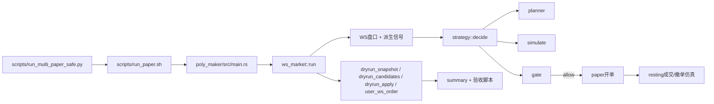
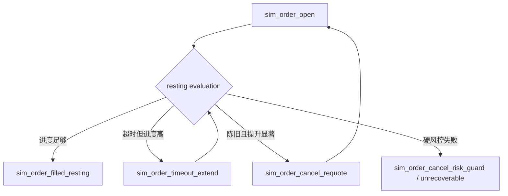

# Poly-Maker-RS（中文）

Language: [English](README.md) | [中文](README_zh.md)

本仓库是一个基于 Rust 的 **仅 Maker（maker-only）** Polymarket CLOB 套利机器人，包含完整的 paper trading 仿真与验收流程。

本文档是当前稳定策略版本的**中文深度说明**，并且只使用一个窗口作为基线：

- 基线窗口：`logs/multi/btc/1771676100/btc_1771676100_paper.jsonl`
- 基线故事图：`logs/multi/btc/1771676100/btc_1771676100_paper_story.png`

本文不使用旧窗口做结论（旧窗口代码版本不同）。

---

## [S00A] 阅读导航（一页式索引）

如果你是第一次读这个仓库，建议按这个顺序：

1. 先看 `S00` 统一记号和事件词汇。
2. 再看 `S04` + `S05` + `S06` 理解决策、仓位和开轮条件。
3. 再看 `S07` + `S08` 理解定价模型和硬 no-risk 风控。
4. 再看 `S10` + `S11` 看 `1771676100` 的真实案例。
5. 最后看 `S12` 直接复跑验收命令。

### 基线成绩单（`1771676100`）

| 目标 | 指标 | 结果 |
| --- | --- | --- |
| 仅 Maker | taker 行为 | 无 |
| 硬风控 pair cap | max executed pair cost | `0.9886585366 <= 0.995` |
| 执行质量 | fill rate | `61/63 = 0.9683` |
| 仓位收口 | final abs net | `0` |
| 资金使用 | spent total | `91.61 / 100` |
| 配对套利质量 | final pair cost | `0.9850537634 < 1` |

### 按问题快速跳转

- “为什么当下开/不开单？” -> `S06`、`S09B`、`S10`。
- “每次下单股数怎么来的？” -> `S05`。
- “maker 成交概率怎么估算？” -> `S07`、`S09`。
- “no-risk 保护如何起作用？” -> `S08`、`S11`。
- “怎么复跑验收？” -> `S12`。

---

## [S00] 记号与核心术语

### 合约命名

- `UP` 表示该二元市场的 YES token。
- `DOWN` 表示该二元市场的 NO token。
- 每 1 股在结算时要么兑付 1 USDC，要么兑付 0。

### 仓位与成本记号

- `qty_up`, `qty_down`：当前持仓股数。
- `cost_up`, `cost_down`：对应侧累计花费 USDC。
- `avg_up`, `avg_down`：每股平均持仓成本。
- `pair_cost`：`avg_up + avg_down`。
- `abs_net`：`|qty_up - qty_down|`。

### 轮次术语

- `Leg1`：一轮新开仓的第一腿。
- `Leg2`：用于配平该轮净敞口的第二腿。
- `round_state`：`idle -> leg1_accumulating -> leg2_balancing -> done`。

### JSONL 事件类型

- `dryrun_snapshot`：每个决策 tick 的状态与 planner 上下文。
- `dryrun_candidates`：候选动作及拒绝原因。
- `dryrun_apply`：真实库存变更事件。
- `user_ws_order`：合成订单生命周期事件（开单、成交、撤单、超时延长等）。

---

## [S01] 机器人在做什么

机器人在单个 15 分钟市场上执行 **YES/NO 时间序列配对套利**，并强制满足 no-risk 约束。

### 策略目标

1. 在机会出现时，先在一侧挂 maker 买单。
2. 后续在另一侧挂 maker 买单完成配对。
3. 最终达到 `qty_up == qty_down` 且 `pair_cost < 1`。

### 硬性不变量（必须满足）

1. 仅 Maker 入场（`ALLOW_TAKER=false`）。
2. 已执行仓位满足硬上限（`NO_RISK_HARD_PAIR_CAP=0.995`）。
3. 任何增加风险敞口的动作都必须通过 recoverability 和 margin 检查。
4. 尾盘阶段优先完成收口与配平。

### 实务含义

如果硬风控条件不满足，机器人应当选择不交易，而不是强行执行。

---

## [S02] 系统架构（代码地图）

### 运行入口与主循环

- 入口：`poly_maker/src/main.rs`
- 运行编排（WS、决策循环、paper 执行）：`poly_maker/src/ws_market.rs`

### 策略栈

- Planner 与 round plan：`poly_maker/src/strategy/planner.rs`
- 交易仿真与报价/成交模型：`poly_maker/src/strategy/simulate.rs`
- 风控与执行 gate：`poly_maker/src/strategy/gate.rs`
- 账本与状态机：`poly_maker/src/strategy/state.rs`
- 候选组装与评分：`poly_maker/src/strategy/mod.rs`

### 运行与验收脚本

- 安全 runner 与参数注入：`scripts/run_multi_paper_safe.py`
- 单窗运行封装：`scripts/run_paper.sh`
- 摘要/故事图输出：`scripts/summary_run.py`
- 验收：
  - `scripts/check_run.sh`
  - `scripts/check_fill_estimator.sh`
  - `scripts/check_round_quality.sh`
  - `scripts/check_exec_quality.sh`

### 流程图



---

## [S03] 数据采集与市场选择

### 固定市场模式

本基线窗口固定为：

- `MARKET_SLUG=btc-updown-15m-1771676100`

`scripts/validate_market_slug.py` 校验：

1. slug 格式正确（`*-updown-15m-<ts>`）
2. Gamma 上存在该市场
3. 市场可交易（`acceptingOrders=true`、`enableOrderBook=true`）
4. 两个 token ID 完整

### 运行时持续维护的数据

`ws_market.rs` 每轮会更新并写入 ledger/snapshot：

1. UP/DOWN 的 best bid/ask 与顶档 size
2. 买/卖侧消费速率估计
3. 延迟字段（`exchange_ts_ms` 与本地接收时间）
4. planner 使用的 regime/turning 输入（波动、动量、折价等）

这些数据是后续 simulate、gate、sizing 的基础输入。

---

## [S04] 决策循环（每个 tick 做什么）

每个决策 tick（`DRYRUN_DECISION_EVERY_MS`）执行：

1. 用最新盘口刷新 ledger。
2. 处理现有 resting 单（成交、延时、重挂、风险撤单）。
3. 更新 round state 与 lock state。
4. 产出 `dryrun_snapshot`。
5. 调用 `strategy::decide(...)`。
6. 产出 `dryrun_candidates`。
7. 若有允许且被选中的动作，则开 paper maker 单并记录 `sim_order_open`。
8. 若成交则记录 `sim_order_filled_resting`，并触发 `dryrun_apply`。

### 重要设计点

`strategy/mod.rs` 只有在 `round_plan.can_start_new_round=true` 时才会生成开新轮的 maker 候选。
若需要补腿，只生成补腿动作。

---

## [S05] 每次挂单股数是如何确定的

股数不是单一参数，而是链式约束结果。

### 第 1 步：预算目标数量

`planner.rs` 中 `compute_round_qty_target(...)`：

```text
leg1_budget = round_budget_usdc * round_leg1_fraction
q_budget_leg1 = floor(leg1_budget / price_leg1)
q_budget_pair = floor(round_budget_usdc / (price_leg1 + price_leg2))
q_target_raw = min(q_budget_leg1, q_budget_pair)
```

### 第 2 步：顶档深度上限

`cap_round_qty_by_visible_depth(...)`：

```text
q_depth_cap = floor(top_size_leg1 * ENTRY_MAX_TOP_BOOK_SHARE)
q_after_depth = min(q_target_raw, q_depth_cap)
```

### 第 3 步：预期流量上限

`cap_round_qty_by_expected_flow(...)`：

```text
consume_rate = max(observed_bid_consumption_rate, maker_flow_floor_per_sec)
q_flow_cap = floor(consume_rate * MAKER_FILL_HORIZON_SECS * ENTRY_MAX_FLOW_UTILIZATION)
q_after_flow = min(q_after_depth, q_flow_cap)
```

### 第 4 步：动态切片

`compute_dynamic_slice_count(...)` + `compute_slice_qty(...)`：

```text
slice_count = clamp(derived_count, ROUND_MIN_SLICES, ROUND_MAX_SLICES)
base_slice = ceil(q_after_flow / slice_count)
slice_qty = min(q_remaining, max(ROUND_MIN_SLICE_QTY, base_slice))
```

### 为什么常见 3-6 股

通常是预算、盘口深度、流量上限、切片约束共同作用，不是某一个 gate 单独决定。

---

## [S06] “什么时候可以开新轮套利”

不是单一触发器，而是多个条件合取。

### 核心判定公式

```text
can_start_new_round =
    can_open_round_base_ok
    AND qty_slice_exists
    AND budget_remaining_round > 0
    AND budget_remaining_total > 0
    AND hard_feasible
    AND edge_ok
    AND fillability_ok
    AND regime_score > 0
```

### 各部分含义

1. `can_open_round_base_ok`
- `round_state == idle`
- `abs_net` 接近 0
- 不在尾盘禁止开新轮区间
- 轮次间隔、波动等前置条件满足

2. `hard_feasible`
- `entry_worst_pair_ok`
- `pair_quality_ok`
- `pair_regression_ok`（基线是 `cap_edge`）

3. `edge_ok`
- `entry_edge_bps >= ENTRY_EDGE_MIN_BPS`

4. `fillability_ok`
- timeout flow 通过
- fill probability 下限通过
- passive gap 软上限通过

### 阻断原因可观测

snapshot 里的 `round_plan_can_start_block_reason` 会给出主阻断原因（如 `fillability`、`phase_not_idle`、`directional_gate`、`late_new_round` 等）。

---

## [S07] Maker 报价与成交概率模型

### 7.1 Maker 报价构造（`compute_maker_buy_quote`）

```text
base_postonly_price = 来自 (best_bid, best_ask) 的 post-only 买价

target_margin = max(
    entry_target_margin_min_ticks * tick,
    opp_ask * entry_target_margin_min_bps / 10000
)

dynamic_cap_price = floor_to_tick(
    no_risk_hard_pair_cap
    - entry_dynamic_cap_headroom_bps/10000
    - opp_ask
    - target_margin
)

final_price = min(base_postonly_price, dynamic_cap_price)    # 当 cap 存在
passive_gap_abs = max(base_postonly_price - final_price, 0)
passive_gap_ticks = passive_gap_abs / tick
```

若 `final_price` 不合法（太小或非有限值），该候选不可执行。

### 7.2 成交概率（`maker_fill_prob`）

simulate 与 resting 逻辑都用这一模型：

```text
raw_queue_ahead = queue_size * maker_queue_ahead_mult

effective_queue_ahead = raw_queue_ahead * (
    1 + passive_ticks * maker_fill_passive_queue_penalty_per_tick
)

expected_consumed = consume_rate * horizon_secs
flow_ratio = expected_consumed / (effective_queue_ahead + order_qty)
fill_prob_base = 1 - exp(-flow_ratio)

fill_prob = fill_prob_base * exp(-maker_fill_passive_decay_k * passive_ticks)
fill_prob = clamp(fill_prob, 0, 1)
```

解释：

- 报价越被动，队列压力越大
- 预期流量越低，fill 概率越低
- 报价改善到“插队”位置时，queue_ahead 可显著下降

### 7.3 Maker-only 纪律

策略不会主动跨价吃单入场，保持 maker 费率路径与行为一致。

---

## [S08] 风险控制与仓位控制

风控在 `gate.rs` 分层执行，硬风控优先。

### 8.1 pair_cost 与库存基础（`state.rs`）

```text
avg_up = cost_up / qty_up           (qty_up > 0)
avg_down = cost_down / qty_down     (qty_down > 0)
pair_cost = avg_up + avg_down

hedgeable = min(qty_up, qty_down)
unhedged_up = max(qty_up - qty_down, 0)
unhedged_down = max(qty_down - qty_up, 0)
abs_net = |qty_up - qty_down|
```

### 8.2 recoverability 与 margin（`simulate.rs`）

对增加风险敞口的 BUY 动作：

```text
required_hedge_qty = |new_qty_up - new_qty_down|
total_qty_after_hedge = max(new_qty_up, new_qty_down)

required_opp_avg_price_cap =
    (no_risk_hard_pair_cap * total_qty_after_hedge - total_cost_after_fill)
    / required_hedge_qty

hedge_recoverable_now = (opp_ask <= required_opp_avg_price_cap * (1 + eps_bps/10000))

hedge_margin_to_opp_ask = required_opp_avg_price_cap - opp_ask
hedge_margin_required = max(min_ticks*tick, opp_ask*min_bps/10000)
hedge_margin_ok = hedge_margin_to_opp_ask >= hedge_margin_required
open_margin_surplus = hedge_margin_to_opp_ask - hedge_margin_required
```

### 8.3 Gate 顺序（简化）

1. 禁止 taker
2. 报价有效性（`NoQuote` / low fill fallback）
3. recoverability
4. hedge margin
5. open margin 下限（`OpenMarginTooThin`）
6. 预算上限
7. reserve-for-pair
8. pair cap / no-improve / tail / lock
9. low maker fill probability（带上下文）

### 8.4 Lock 策略

当策略已达到安全进度时，lock 会阻止继续扩大净风险。
对应关键 deny reason 为 `locked_strict_abs_net`。

---

## [S09] Paper 交易仿真（无官方 PM Paper API）

### 9.1 Resting 订单生命周期



### 9.2 自适应超时 horizon

`adaptive_order_horizon_secs(...)` 根据 queue、qty、rate、目标 fill_prob 计算：

```text
required_ratio = -ln(1 - timeout_target_fill_prob)
required_secs = ceil((queue_ahead + qty) * required_ratio / consume_rate)
horizon_secs = clamp(max(base_timeout_secs, required_secs), base_timeout_secs, max_age_secs)
```

### 9.3 超时延长条件

```text
fill_progress_ratio = consumed_qty / (queue_ahead + remaining_qty)

满足以下条件则延长：
    fill_progress_ratio >= paper_timeout_progress_extend_min
    AND timeout_extend_count < paper_timeout_max_extends
    AND paper_timeout_progress_extend_secs > 0
```

### 9.4 重挂条件（质量驱动）

只有在 stale/价格/间隔条件满足且 fill 质量有显著提升时才允许重挂。
关键字段：

- `requote_prev_fill_prob`
- `requote_new_fill_prob`
- `requote_fill_prob_uplift`
- `requote_block_reason`

---

## [S09A] 基线参数快照（`1771676100`）

由 `scripts/run_multi_paper_safe.py` 注入。

| 分组 | 参数 | 基线值 |
| --- | --- | --- |
| 执行 | `ALLOW_TAKER` | `false` |
| 硬风控 | `NO_RISK_HARD_PAIR_CAP` | `0.995` |
| Pair 模式 | `NO_RISK_PAIR_LIMIT_MODE` | `hard_cap_only` |
| 回归模式 | `ENTRY_PAIR_REGRESSION_MODE` | `cap_edge` |
| 轮次 | `MAX_ROUNDS` | `6` |
| Edge 下限 | `ENTRY_EDGE_MIN_BPS` | `20` |
| 入场 fill 下限 | `ENTRY_FILL_PROB_MIN` | `0.05` |
| 开仓 fill 下限 | `OPEN_MIN_FILL_PROB` | `0.06` |
| 动态 cap 头寸 | `ENTRY_DYNAMIC_CAP_HEADROOM_BPS` | `5` |
| margin 目标 ticks | `ENTRY_TARGET_MARGIN_MIN_TICKS` | `0.3` |
| margin 目标 bps | `ENTRY_TARGET_MARGIN_MIN_BPS` | `5` |
| 被动软上限 | `ENTRY_PASSIVE_GAP_SOFT_MAX_TICKS` | `3.0` |
| 队列惩罚 | `MAKER_FILL_PASSIVE_QUEUE_PENALTY_PER_TICK` | `1.25` |
| 被动衰减 | `MAKER_FILL_PASSIVE_DECAY_K` | `0.35` |
| Fill horizon | `MAKER_FILL_HORIZON_SECS` | `12` |
| 深度上限 | `ENTRY_MAX_TOP_BOOK_SHARE` | `0.35` |
| 流量上限 | `ENTRY_MAX_FLOW_UTILIZATION` | `0.75` |
| 超时 | `PAPER_ORDER_TIMEOUT_SECS` | `18` |
| 超时延长阈值 | `PAPER_TIMEOUT_PROGRESS_EXTEND_MIN` | `0.50` |
| 超时延长秒数 | `PAPER_TIMEOUT_PROGRESS_EXTEND_SECS` | `12` |
| Requote 最小提升 | `REQUOTE_MIN_FILL_PROB_UPLIFT` | `0.015` |
| 锁仓轮次 | `LOCK_MIN_COMPLETED_ROUNDS` | `5` |
| 锁仓资金比例 | `LOCK_MIN_SPENT_RATIO` | `0.55` |
| 开仓 margin surplus 下限 | `OPEN_MARGIN_SURPLUS_MIN` | `0.0005` |

---

## [S09B] 字段词典（重要名词与真实含义）

### Snapshot（`dryrun_snapshot`）字段

| 字段 | 代码中的真实含义 |
| --- | --- |
| `can_start_new_round` | planner 最终是否允许开新轮第一腿 |
| `round_plan_can_start_block_reason` | planner 决策树中第一个失败条件 |
| `round_plan_pair_quality_ok` | 预测 pair cost 是否满足入场 pair 上限 |
| `round_plan_pair_regression_ok` | 回归模式检查是否通过（strict/soft/cap_edge） |
| `round_plan_entry_timeout_flow_ok` | timeout flow ratio 是否达标 |
| `round_plan_entry_fillability_ok` | fillability 组合门（flow + fill prob + passive gap） |
| `round_plan_entry_edge_bps` | 相对上限的 edge（bps） |
| `round_plan_entry_regime_score` | 候选排序中的 regime 分数 |
| `round_plan_slice_count_planned` | planner 计划的切片数量 |
| `round_plan_slice_qty_current` | 本 tick 计划下单股数 |
| `pair_cost` | 当前库存平均 pair 成本（`avg_up + avg_down`） |
| `qty_up`, `qty_down` | 当前持仓 |
| `spent_total_usdc` | 本窗口累计已使用资金 |
| `round_state` | 状态机阶段 |
| `locked` | 当前是否处于 lock 策略 |
| `max_executed_sim_pair_cost_window` | 本窗口已执行动作中的最差 pair cost |
| `timeout_extend_count_window` | 本窗口超时延长次数 |
| `cancel_unrecoverable_count_window` | 本窗口不可恢复撤单次数 |

### Candidate（`dryrun_candidates.candidates[]`）字段

| 字段 | 真实含义 |
| --- | --- |
| `action` | 动作标识（如 `BUY_UP_MAKER`） |
| `qty` | 该候选建议下单股数（已过规划/切片） |
| `fill_price` | simulate 里该候选的成交价 |
| `maker_fill_prob` | 基于 queue/flow/passive 的成交概率估计 |
| `maker_queue_ahead` | 被动惩罚后的有效排队量 |
| `maker_expected_consumed` | horizon 内预计可被市场消费的量 |
| `sim_pair_cost` | 若执行该候选，预计 pair cost |
| `hedge_recoverable_now` | 执行后当前是否仍可在 hard cap 内补齐 |
| `hedge_margin_ok` | 执行后 hedge margin 是否满足 |
| `open_margin_surplus` | `hedge_margin_to_opp_ask - hedge_margin_required` |
| `deny_reason` | gate 拒绝原因 |

### Order/Event（`user_ws_order`）字段

| 字段 | 真实含义 |
| --- | --- |
| `raw_type=sim_order_open` | paper maker 单已开出 |
| `raw_type=sim_order_filled_resting` | resting 单按仿真模型成交 |
| `raw_type=sim_order_timeout_extend` | 因高进度触发超时延长 |
| `raw_type=sim_order_cancel_requote` | 因质量提升触发重挂撤单 |
| `raw_type=sim_order_cancel_unrecoverable` | 因继续持单会破坏风险条件而撤单 |
| `fill_progress_ratio` | 已消费进度占所需消费量比例 |
| `old_horizon_secs/new_horizon_secs` | 延长前后超时窗口 |
| `requote_prev_fill_prob/new_fill_prob` | 重挂前后预估成交概率 |
| `requote_fill_prob_uplift` | 重挂带来的概率提升 |

### 本基线里出现的关键 deny reason

| deny reason | 本代码路径中的含义 |
| --- | --- |
| `reserve_for_pair` | 为保障配对完成，限制错误相位/方向的扩仓 |
| `locked_strict_abs_net` | lock 生效后禁止增加绝对净仓 |

### 字段到代码定位（source of truth）

| 概念 / 字段 | 主要代码位置 |
| --- | --- |
| `pair_cost`、`hedgeable`、`abs_net` | `poly_maker/src/strategy/state.rs`（`Ledger` 方法） |
| `round_plan_*` 开轮/阻断逻辑 | `poly_maker/src/strategy/planner.rs`（`plan_round`） |
| 目标股数 / 深度 cap / 流量 cap / 切片 | `poly_maker/src/strategy/planner.rs`（`compute_round_qty_target`、`cap_*`、`compute_slice_qty`） |
| maker 报价（`entry_quote_*`、`passive_gap_*`） | `poly_maker/src/strategy/simulate.rs`（`compute_maker_buy_quote`） |
| `maker_fill_prob`、`maker_queue_ahead`、`maker_expected_consumed` | `poly_maker/src/strategy/simulate.rs`（`simulate_trade`） |
| `hedge_recoverable_now`、`required_opp_avg_price_cap` | `poly_maker/src/strategy/simulate.rs`（`evaluate_hedge_recoverability`） |
| `open_margin_surplus` 与 margin 相关检查 | `poly_maker/src/strategy/simulate.rs` + `poly_maker/src/strategy/gate.rs` |
| deny reason（`reserve_for_pair`、`locked_strict_abs_net` 等） | `poly_maker/src/strategy/gate.rs`（`evaluate_action_gate_with_context`） |
| `sim_order_timeout_extend` 与延长计数 | `poly_maker/src/ws_market.rs`（`process_paper_resting_fills`） |
| `sim_order_cancel_requote` 与 uplift 字段 | `poly_maker/src/ws_market.rs`（`process_paper_resting_fills`） |
| 验收指标（`wait_per_selected`、`allow_fill_prob_p50`、`spent_utilization`） | `scripts/check_exec_quality.sh`（内嵌 Python） |
| 轮次指标（`apply_interval_p50`、资金利用检查） | `scripts/check_round_quality.sh`（内嵌 Python） |

---

## [S10] 主窗深挖：`1771676100`

### 核心产物

- `logs/multi/btc/1771676100/btc_1771676100_paper_story.md`
- `logs/multi/btc/1771676100/btc_1771676100_paper_story_events.csv`
- `logs/multi/btc/1771676100/btc_1771676100_paper_timeseries.csv`
- `logs/multi/btc/1771676100/btc_1771676100_paper_denies.csv`
- `logs/multi/btc/1771676100/btc_1771676100_paper_story.png`


### 终态指标（同窗事实）

| 指标 | 数值 |
| --- | ---: |
| `best_action_ticks` | 815 |
| `candidate_applied_ticks` | 815 |
| `dryrun_apply` | 61 |
| `sim_order_open` | 63 |
| `sim_order_filled_resting` | 61 |
| Fill rate（`fill/open`） | 0.9683 |
| `spent_total_usdc` | 91.61 |
| `pair_cost_final` | 0.9850537634 |
| `qty_up` | 93 |
| `qty_down` | 93 |
| `final_abs_net` | 0 |
| `max_executed_sim_pair_cost_window` | 0.9886585366（`<= 0.995`） |

### 时序里程碑（相对窗口起点）

| 时间（s） | 事件 |
| ---: | --- |
| 20.301 | 首次 `can_start_new_round=true` |
| 20.303 | 首次 `sim_order_open`（`buy`，`price=0.32`，`size=6`） |
| 36.701 | 首次 `sim_order_filled_resting` 与首次真实 apply |
| 283.007 | 首次观察到 `locked=true` |
| 531.901 | spent 超过 90 USDC |
| 532.302 | 最后一次 resting fill |
| 538.103 | 首次出现 `locked_strict_abs_net` deny |

### 前后半场活动分布

按 snapshot 时间中点切分：

- `spent_by_half`：前半 `81.07`，后半 `91.61`
- `open/fill`：
  - 前半：open `55`，fill `52`
  - 后半：open `8`，fill `9`

解读：

- 前半场更积极，因剩余轮次和时间更充足
- 后半场进入更强的收口/lock 保护，增量资金变小

### 本窗 planner/gate 上下文

- `can_start_new_round_true_ratio = 0.3166`（1195 / 3775）
- snapshot 主阻断：
  - `fillability: 1583`
  - `phase_not_idle: 761`
  - `directional_gate: 153`
  - `leg2_balancing: 60`
  - `late_new_round: 22`

这符合预期：策略大量时间在活跃相位（开腿/补腿）中，仅在所有条件都满足时才开新轮。

---

## [S11] `1771676100` 的局部阻断与修复案例

这些是**受控局部事件**，不是系统失效。

### 11.1 `reserve_for_pair` 阻断（计数 = 5）

`t=112.605s` 样例：

- candidate：`BUY_DOWN_MAKER`，qty `24`
- 质量指标仍健康：
  - `maker_fill_prob=0.11563`
  - `sim_pair_cost=0.976`
  - `hedge_recoverable_now=true`
  - `hedge_margin_ok=true`
- 被 `reserve_for_pair` 拒绝

含义：当时策略优先保障配对完成，不允许该方向继续扩仓。

### 11.2 `locked_strict_abs_net` 阻断（计数 = 435）

`t=538.103s` 样例：

- candidate：`BUY_DOWN_MAKER`，qty `3`
- 质量仍可行：
  - `maker_fill_prob=0.16109`
  - `sim_pair_cost=0.98188`
- 被 `locked_strict_abs_net` 拒绝

含义：lock 激活后，禁止继续增加净风险。

### 11.3 超时延长保护近成交订单（计数 = 4）

`t=110.403s` 样例：

- `fill_progress_ratio=0.88852`
- `old_horizon_secs=53 -> new_horizon_secs=65`
- `passive_ticks_at_extend=4`

含义：订单推进已明显，不应机械超时撤单。

### 11.4 仅在质量显著提升时重挂（计数 = 2）

`t=361.110s` 样例：

- `requote_prev_fill_prob=0.01750`
- `requote_new_fill_prob=0.43102`
- uplift `+0.41352`
- `requote_block_reason=hard_stale_with_uplift`

含义：重挂是“质量修复动作”，不是无意义抖动。

---

## [S12] 验收流程（可直接复跑）

### 1）脚本语法检查

```bash
bash -n scripts/check_run.sh scripts/check_fill_estimator.sh scripts/check_round_quality.sh scripts/check_exec_quality.sh
```

### 2）定位最新窗口

```bash
NEW_DIR="$(ls -td logs/multi/btc/[0-9]* | head -1)"
NEW_JSONL="$(ls "$NEW_DIR"/*_paper.jsonl | head -1)"
echo "NEW_DIR=$NEW_DIR"
echo "NEW_JSONL=$NEW_JSONL"
[[ -s "$NEW_JSONL" ]] || { echo "ERROR: empty jsonl"; exit 1; }
```

### 3）摘要 + 全量验收

```bash
python scripts/summary_run.py "$NEW_JSONL" --story-plot
bash scripts/check_run.sh "$NEW_JSONL"
bash scripts/check_fill_estimator.sh "$NEW_JSONL"
MAX_ROUNDS=6 APPLY_INTERVAL_P50_EPS=0.005 bash scripts/check_round_quality.sh "$NEW_JSONL"
bash scripts/check_exec_quality.sh "$NEW_JSONL"
```

### 4）快速数值提取（可选）

```bash
python - <<'PY' "$NEW_JSONL"
import json,sys,collections
p=sys.argv[1]
c=collections.Counter(); best=applied=dry=0; spent=pair=absn=None
for ln in open(p):
    o=json.loads(ln); d=o.get("data",{}) or {}
    if o.get("kind")=="dryrun_candidates":
        if d.get("best_action") is not None: best += 1
        if d.get("applied_action") is not None: applied += 1
        for x in d.get("candidates") or []:
            r=x.get("deny_reason")
            if r: c[r]+=1
    if o.get("kind")=="dryrun_apply": dry += 1
    if o.get("kind")=="user_ws_order":
        rt=d.get("raw_type")
        if rt: c[rt]+=1
    if o.get("kind")=="dryrun_snapshot":
        if isinstance(d.get("spent_total_usdc"),(int,float)): spent=float(d["spent_total_usdc"])
        if isinstance(d.get("pair_cost"),(int,float)): pair=float(d["pair_cost"])
        q1,q2=d.get("qty_up"),d.get("qty_down")
        if isinstance(q1,(int,float)) and isinstance(q2,(int,float)): absn=abs(float(q1)-float(q2))
open_n=c.get("sim_order_open",0); fill_n=c.get("sim_order_filled_resting",0)
print("best_action_ticks=",best,"candidate_applied_ticks=",applied,"dryrun_apply=",dry)
print("fill_rate=", round(fill_n/open_n,4) if open_n else None, "open=",open_n,"fill=",fill_n)
print("spent_total_usdc=",spent,"pair_cost_final=",pair,"final_abs_net=",absn)
print("top_counts=",c.most_common(12))
PY
```

---

## [S13] 已知限制与下一步

1. 设计上不走 taker 入场，因此会放弃必须立即吃单的机会。
2. PnL 目前未做 maker rebate / taker fee 的精细记账。
3. paper 成交是模型驱动（queue/flow/probability），非交易所原生 paper fill。
4. 跨窗口滚动预算（上一窗 PnL 并入下一窗）尚未在本阶段启用。

---

## [A1] 术语索引附录

把这个附录当作日志、验收脚本、代码阅读时的速查字典。

| 术语 / 字段 | 实际含义 | 主要来源位置 |
| --- | --- | --- |
| `abs_net` | 绝对净仓：`|qty_up - qty_down|` | `poly_maker/src/strategy/state.rs` |
| `allow_fill_prob_p50` | 窗口内“被允许候选”的 `maker_fill_prob` 中位数 | `scripts/check_exec_quality.sh` |
| `avg_up`, `avg_down` | 两侧持仓平均成本 | `poly_maker/src/strategy/state.rs` |
| `balance_leg` | planner 选出的补腿方向（用于配平净仓） | `poly_maker/src/strategy/planner.rs` |
| `can_start_new_round` | planner 判定：此刻是否允许开新轮第一腿 | `poly_maker/src/strategy/planner.rs` |
| `cap_edge` | 回归模式：使用 cap + edge 门槛，而非严格单调回归 | `poly_maker/src/strategy/params.rs`, `planner.rs` |
| `decision_seq` | 递增决策序号，用于时序定位 | `dryrun_snapshot`, `dryrun_candidates` |
| `dryrun_apply` | 库存真实发生变更时记录的事件 | JSONL `kind=dryrun_apply` |
| `dryrun_candidates` | 每 tick 候选动作列表（含仿真指标与 deny） | JSONL `kind=dryrun_candidates` |
| `dryrun_snapshot` | 每 tick 状态与 planner 上下文快照 | JSONL `kind=dryrun_snapshot` |
| `entry_edge_bps` | 入场质量 edge（基点） | `planner.rs` |
| `entry_fillability_ok` | fillability 组合门是否通过（flow + fill prob + passive gap） | `planner.rs` |
| `fill_progress_ratio` | resting 订单进度比例（用于判定是否超时延长） | `ws_market.rs` |
| `fill_rate` | `sim_order_filled_resting / sim_order_open` | `scripts/check_exec_quality.sh` |
| `hedge_margin_ok` | 预测交易后 hedge margin 是否满足 | `simulate.rs` / `gate.rs` |
| `hedge_recoverable_now` | 预测交易后是否仍可在 hard cap 下补齐对腿 | `simulate.rs` / `gate.rs` |
| `locked` | snapshot 中 lock 策略是否激活 | `dryrun_snapshot` |
| `locked_strict_abs_net` | deny 原因：lock 阶段禁止继续增加绝对净仓 | `gate.rs` |
| `maker_fill_prob` | maker 成交概率模型输出（queue/flow/passive） | `simulate.rs` |
| `maker_queue_ahead` | 被动修正后的有效排队量 | `simulate.rs` |
| `max_executed_sim_pair_cost_window` | 当前窗口已执行动作中的最差 pair cost | `dryrun_snapshot` |
| `open_margin_surplus` | `hedge_margin_to_opp_ask - hedge_margin_required` | `simulate.rs`, `gate.rs` |
| `pair_cost` | 平均配对成本：`avg_up + avg_down` | `state.rs` |
| `phase_not_idle` | 常见阻断原因：当前不在空闲开轮相位 | `round_plan_can_start_block_reason` |
| `reserve_for_pair` | deny 原因：为了配对完成，保留预算/相位约束 | `gate.rs` |
| `round_state` | 轮次状态机（`idle`、`leg1_accumulating`、`leg2_balancing`、`done`） | `state.rs`, snapshot |
| `sim_order_cancel_requote` | 事件：撤销当前订单并以更优预期质量重挂 | `ws_market.rs` |
| `sim_order_filled_resting` | 事件：paper 仿真中 resting maker 单成交 | `ws_market.rs` |
| `sim_order_open` | 事件：paper maker 单开出 | `ws_market.rs` |
| `sim_order_timeout_extend` | 事件：超时前延长订单观察期 | `ws_market.rs` |
| `spent_total_usdc` | 窗口内累计资金消耗 | snapshot/check scripts |
| `timeout_extend_count_window` | 当前窗口超时延长累计次数 | snapshot/check scripts |
| `wait_per_selected(activity_ratio)` | 执行质量检查中的等待活动占比指标 | `scripts/check_exec_quality.sh` |

### 按前缀分组的 JSONL 字段地图

这个视图更适合按字段名前缀做 grep 和排障。

| 前缀 | 常见 `kind` | 示例字段 | 这组字段告诉你什么 |
| --- | --- | --- | --- |
| `round_plan_*` | `dryrun_snapshot`, `dryrun_candidates` | `round_plan_can_start_block_reason`, `round_plan_entry_edge_bps`, `round_plan_slice_qty_current` | planner 在本 tick 的意图、阻断原因、计划下单规模 |
| `maker_*` | `dryrun_candidates` | `maker_fill_prob`, `maker_queue_ahead`, `maker_expected_consumed` | 成交质量模型输出（排队、流量、可成交性） |
| `entry_quote_*` | `dryrun_candidates`, `dryrun_apply` | `entry_quote_base_postonly_price`, `entry_quote_dynamic_cap_price`, `entry_quote_final_price` | maker 报价如何形成（post-only 基准与 dynamic cap 约束） |
| `hedge_*` | `dryrun_candidates`, `dryrun_apply`, `sim_order_open` | `hedge_recoverable_now`, `hedge_margin_ok`, `hedge_margin_to_opp_ask` | 加这条腿后是否仍可安全补齐配对 |
| `required_*` | `dryrun_candidates` | `required_opp_avg_price_cap`, `required_hedge_qty` | 由预测仓位推导出的可恢复目标和对冲需求 |
| `open_margin_*` | `dryrun_candidates`, `sim_order_open` | `open_margin_surplus` | 相对最小 margin 要求的安全余量 |
| `qty_*` / `cost_*` / `avg_*` | `dryrun_snapshot`, `dryrun_apply` | `qty_up`, `qty_down`, `cost_up`, `avg_down` | 仓位结构与平均成本的演化 |
| `spent_*` / `*_budget_*` | `dryrun_snapshot` | `spent_total_usdc`, `spent_round_usdc`, `total_budget_usdc` | 资金使用进度与剩余预算空间 |
| `round_*` | `dryrun_snapshot` | `round_state`, `round_idx`, `round_leg1_filled_qty` | 轮次状态机与阶段推进情况 |
| `locked*` / `lock_*` | `dryrun_snapshot`, `dryrun_candidates` | `locked`, `locked_hedgeable`, deny `locked_strict_abs_net` | 安全锁定模式，抑制新的净风险扩张 |
| `*_count_window` | `dryrun_snapshot` | `fill_count_window`, `requote_count_window`, `timeout_extend_count_window` | 验收脚本使用的窗口内滚动执行/风险计数 |
| `best_*` | `dryrun_snapshot` | `best_bid_up`, `best_ask_down`, `best_bid_size_up` | 实时盘口顶档价格与顶档深度输入 |
| `mid_*` / `pair_mid_*` | `dryrun_snapshot` | `mid_up_momentum_bps`, `pair_mid_vol_bps` | 入场 gating/评分使用的波动与 regime 特征 |
| `raw_type=sim_order_*` | `user_ws_order` | `sim_order_open`, `sim_order_filled_resting`, `sim_order_cancel_requote` | paper 订单生命周期事件 |
| `deny_reason*` | `dryrun_candidates` | `deny_reason`, `deny_reason_top3`（decisions CSV） | 候选在 gate 时被拒绝的直接原因 |

### 常用公式速查

```text
pair_cost = avg_up + avg_down
abs_net = |qty_up - qty_down|
fill_rate = fills / opens
open_margin_surplus = hedge_margin_to_opp_ask - hedge_margin_required
```

---

## 最小运行指南

### 依赖

- Rust 1.75+
- `python3`
- `jq`
- 可选：`matplotlib`

### 环境

```bash
conda env create -f environment.yml
conda activate poly-maker
```

### 单窗 paper 运行

```bash
DRYRUN_MODE=paper \
ROLLOVER_LOG_JSON=1 \
ROLLOVER_LOG_VERBOSE=0 \
RUST_LOG=info \
./scripts/run_paper.sh
```

### 主要输出

- `logs/<run_id>_paper_full.log`
- `logs/<run_id>_paper.jsonl`
- `logs/<run_id>_paper_summary.md`
- `logs/<run_id>_paper_story.md`
- `logs/<run_id>_paper_story.png`
